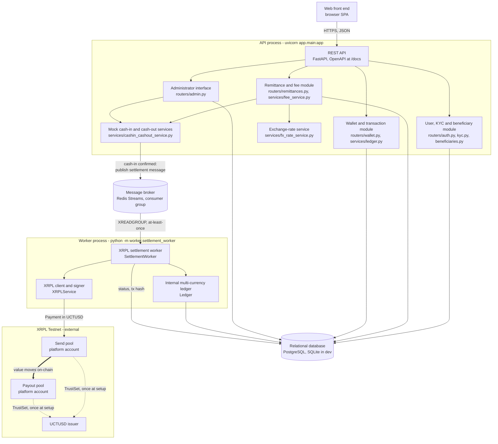

# CrossFX — Business and Technical Specification

*ECO5040W — Financial Software Engineering, UCT — Group 4*
*Ndumiso Zondi (ZNDNDU007) · Marco Klopper (KLPMAR012) · Muki Mdluli (MDLMUK001) · Rafaela Stevenson (STVRAF001)*

**Repository:** https://github.com/Marco-Klopper/crossfx

**Performance testing results:** submitted as a separate, clearly marked document, *CrossFX Performance Testing Results*.

*This is the condensed submission version. The repository holds the full-length specification (`docs/technical-specification.md`) with complete design rationale, edge cases and requirement-by-requirement traceability.*

## 1. Business Problem

Remittances are one of the largest financial flows into developing economies and one of the most expensive to send. The global average cost of sending the equivalent of USD 200 is roughly 6% against a UN target of 3%, and sub-Saharan Africa is consistently the most expensive receiving region. South Africa is the dominant sending country for the Southern African corridor: migrant workers remit rand home in small amounts, where a fixed fee bites hardest.

The cost is structural. A traditional transfer passes through a sending agent, its bank, correspondent banks, a receiving institution and a payout agent, each taking a fee and adding delay. Transfers take one to five business days and cost the sender 5–15%, with much of that hidden in the exchange rate. CrossFX responds to three problems:

1. **Price opacity.** Providers advertise "zero fees" and recover the margin in a marked-up rate. CrossFX discloses the mid-market rate, the transaction fee, the FX margin and the all-in effective rate as separate figures (§4, §5).
2. **Settlement latency and cost.** A stablecoin settles between corridor pools in seconds on a public ledger with a verifiable transaction hash (§9).
3. **Recipient access.** Many recipients are unbanked. A custodial web wallet lets them hold value and cash out on their own schedule (§9, §10).

A stablecoin does not remove the need for fiat cash-in and cash-out networks, funded liquidity, secure custody or regulatory compliance (§14). The settlement instrument changes; the obligations do not.

**Scope.** CrossFX is an academic prototype. It moves no real money, holds no production credentials, and runs only on the XRP Ledger Testnet.

## 2. User Journey

The brief's eleven steps, mapped to screens, endpoints and resulting state. Thandi is a sender in Cape Town; Blessing is the recipient.

| # | Step | Endpoint | Resulting state |
|---|---|---|---|
| 1 | Thandi registers and logs in | `POST /auth/register`, `/auth/login` | `kyc_status = not_started` |
| 2 | She completes mock KYC; an admin approves | `POST /kyc/apply`, admin `/approve` | `approved`; limits R3 000 / R25 000 |
| 3 | She adds Blessing as a recipient | `POST /beneficiaries/` | beneficiary row |
| 4–6 | She enters R1 000; the rate is fetched; fees, margin and UCTUSD are shown | `POST /remittances/quote` | `quoted`, expires in 15 minutes |
| 7 | She confirms a simulated ZAR cash-in | `POST /remittances/{id}/confirm-cash-in` | `cash_in_confirmed` |
| 8 | A settlement message is queued | `SettlementQueue.publish` | `queued` |
| 9 | A worker transfers UCTUSD on XRPL Testnet | `SettlementWorker.settle` | `settling` → `settled` with tx hash |
| 10 | Blessing logs in and sees the UCTUSD | `GET /wallet/balance`, `/wallet/transactions` | ledger credited |
| 11 | He requests a simulated cash-out; an admin approves | `POST /wallet/cash-out`, admin `/approve` | `requested` → `completed` |

Design points: steps 8–9 have no screen (the UI polls the remittance, which is the asynchronous boundary the brief mandates); step 2 is a hard gate because an unverified limit is R0; and step 11 is not KYC-gated, a prototype simplification recorded in §15.

**Failure paths.** An expired quote is refused with `409`. A send that breaches a limit is refused with `403` naming the period and headroom. A cash-in confirmed while the queue is down returns `200` with `queued: false`, because telling a sender that a payment already taken has failed invites them to pay twice.

## 3. Functional Requirements

Each requirement in the brief's functional scope, and where it is implemented.

| Area | Requirement | Implementation |
|---|---|---|
| Accounts | Register, log in and out; manage profile; view KYC status, limits, wallet balance and history | `routers/auth.py` (`GET`/`PATCH /auth/me`), JWT with 60-minute expiry |
| | Passwords hashed, never plaintext | bcrypt via `passlib` |
| Mock KYC | Collect the eight prescribed fields; admin approves or rejects; only approved users send | `schemas/kyc.py`, `/admin/kyc/{id}/approve\|reject`, `require_kyc_approved` |
| Beneficiaries | Add and view; name, contact, country, payout currency, relationship | `routers/beneficiaries.py`; `UNIQUE(sender_id, contact)` |
| Limits | Configurable daily and monthly; reject a remittance that would exceed either | `limits_service.assert_within_limits` (§6) |
| Rates and fees | Use the rate applicable at creation; API, mock or table source; quote shows send amount, rate, fee, margin, UCTUSD received, cash-out fee and estimated payout; all fees configurable | `fx_rate_service`, `fee_service`, `POST /remittances/quote` (§4, §5) |
| Cash-in | Simulated agent, bank or card payment; confirmed by admin or mock service; no transfer before confirmation | `cash_in_method`, `/admin/remittances/{id}/confirm-payment` (§8) |
| Custodial wallet | Balance, incoming, outgoing, status, date, tx hash; approach explained | pooled custody with an internal ledger (§9.1) |
| XRPL | Account setup, TrustSet, transfer, signing, submission, hash storage, validation, failure handling | `services/xrpl_service.py`, `scripts/init_platform_wallets.py` |
| Queue | Asynchronous processing; six-step flow; no duplicate credit | Redis Streams consumer group; three idempotency mechanisms (§9.5) |
| Key security | Encrypted; key held outside the database; never returned, logged or committed; decrypted only by the signer | Fernet ciphertext, `PRIVATE_KEY_ENCRYPTION_KEY`, single decrypt call (§13) |
| Cash-out | USD or local currency at the applicable rate, less the fee; statuses requested/approved/completed/failed | `POST /wallet/cash-out`, `CashOutStatus` (§10) |
| Non-functional | Modular Python framework, relational SQL, JSON API with OpenAPI, web front end, six performance metrics | FastAPI, PostgreSQL/SQLite, Swagger at `/docs`, React + Vite, `performance-testing/` |

## 4. Fee Model

Every charge is a configuration value in `app/config.py` and `.env`; nothing hardcodes a number.

| Charge | Setting | Default | Applied to |
|---|---|---|---|
| Fixed transaction fee | `FIXED_REMITTANCE_FEE_ZAR` | R25 | every remittance |
| Percentage transaction fee | `PERCENT_FEE_BPS` | 150 bps (1.50%) | ZAR send amount |
| FX margin | `FX_MARGIN_BPS` | 100 bps (1.00%) | ZAR send amount |
| Cash-out fee | `CASHOUT_FEE_BPS` | 100 bps (1.00%) | UCTUSD cashed out |

The fixed fee covers per-transaction corridor cost, the percentage fee covers risk and float, and the margin is the currency spread, shown as its own line rather than hidden in the rate.

**The margin is charged once.** The margin is deducted from the rand and the remainder converts at the mid-market rate. An earlier draft also marked up the rate, billing the spread twice; `test_margin_is_charged_once_not_twice` now guards it.

```
transaction_fee_zar = FIXED_REMITTANCE_FEE_ZAR + zar_send_amount × PERCENT_FEE_BPS / 10 000
fx_margin_zar       = zar_send_amount × FX_MARGIN_BPS / 10 000
net_converted_zar   = zar_send_amount − transaction_fee_zar − fx_margin_zar
uctusd_amount       = net_converted_zar / usd_zar_rate          (mid-market, §5)
effective_rate      = zar_send_amount / uctusd_amount           (disclosed all-in rate)
```

**Worked example: R1 000 at 18.50.**

| Line | Amount |
|---|---|
| Send amount | R1 000.00 |
| Transaction fee (R25 + 1.50%) | −R40.00 |
| FX margin (1.00%) | −R10.00 |
| Converted | R950.00 |
| **Recipient receives** | **51.351351 UCTUSD** |
| All-in effective rate | 19.473684 ZAR per UCTUSD |
| Estimated cash-out fee (1.00%) | 0.513513 UCTUSD |
| **Estimated USD payout** | **$50.83** |

The total cost is R50 on R1 000 (5.0% all-in) against a World Bank global average near 6.2%. **Rounding:** fiat to two decimal places and UCTUSD to six; fees round half-up and anything credited to a customer rounds down, so the payout pool always covers every claim (§9.5).

## 5. Exchange-Rate Calculation

One corridor, one pair: **USD/ZAR**, quoted as rand per dollar. UCTUSD is a USD-denominated IOU, so a UCTUSD amount and a USD amount are the same number. `fx_rate_service.get_usd_zar_rate(db)` has three interchangeable sources, selected by `EXCHANGE_RATE_SOURCE`:

| Source | Behaviour | Use |
|---|---|---|
| `mock` (default) | Deterministic rate drifting around 18.50 by at most 150 bps, a pure function of the clock | Demo and load tests |
| `api` | A public keyless endpoint, cached, falling back to the last good rate | Realism |
| `table` | The most recent `fx_rates` row | A pinned rate for marking |

The default is a mock so the quote endpoint stays pure computation: an outbound HTTP call per quote would measure a third party's API instead of CrossFX. It still moves, because a constant would demonstrate nothing.

**The rate is locked at quote time.** A quote stores `fx_rate_used` and is honoured for `QUOTE_TTL_MINUTES` (15). Confirming an expired quote returns `409`. The quote returns both `fx_rate` (mid-market, no margin) and `effective_rate` (all-in), so the customer sees both the advertised rate and the real price.

## 6. Remittance Limits

| KYC status | Daily | Monthly | Setting |
|---|---|---|---|
| `approved` | R3 000 | R25 000 | `VERIFIED_DAILY_LIMIT` / `VERIFIED_MONTHLY_LIMIT` |
| anything else | R0 | R0 | `UNVERIFIED_*` |

An unverified limit of zero makes "complete KYC before sending" a consequence of the limit model, not a separate rule. `limits_service` answers two further questions:

- **Window.** The calendar day and month at UTC+02:00 (South Africa has no daylight saving), so the daily limit resets at local midnight.
- **What consumes headroom.** Unexpired `quoted`, `cash_in_confirmed`, `queued`, `settling` and `settled` remittances count; expired quotes and `failed` ones do not. A quote is persisted as a row because that row is the reservation, and its expiry returns the headroom if it is never used.

A breach returns `403` (not `422`, since the request is valid) naming the period, the limit and the headroom left. The daily limit is checked first because "come back tomorrow" is actionable. Each quote carries a `limits` block so the screen shows the sender where they stand.

## 7. Architecture Diagram



### 7.1 Components

| Brief component | Implementation |
|---|---|
| Web front end | `frontend/`, React + Vite single-page app; sender, recipient and admin screens |
| REST API | `app/main.py`, FastAPI, OpenAPI at `/docs` |
| Relational database | PostgreSQL; SQLite for development and CI |
| User and KYC module | `routers/auth.py`, `kyc.py`, `beneficiaries.py` |
| Remittance and fee module | `routers/remittances.py`, `services/fee_service.py`, `services/limits_service.py` |
| Wallet and transaction module | `routers/wallet.py`, `services/ledger.py` |
| Exchange-rate service | `services/fx_rate_service.py` |
| Message broker | Redis Streams, `services/settlement_queue.py` |
| XRPL settlement worker | `worker/settlement_worker.py` |
| Mock cash-in and cash-out | `services/cashin_cashout_service.py` |
| Administrator interface | `routers/admin.py` |

### 7.2 Two processes, one database

The API and the settlement worker are separate operating-system processes sharing only the database and the broker. This follows from the brief's asynchronous requirement: the request path never waits on XRPL (a validated ledger takes seconds); the API and workers scale independently, since several workers can share the consumer group; and failure is isolated, since a crashed worker leaves the API serving and its unacked messages replay on restart.

### 7.3 Trust boundaries and technology

Stateless JWTs protect the browser-to-API boundary. No API route can reach a wallet seed, because only `XRPLService`, in the worker process, decrypts one. The database holds seeds only as ciphertext, with the key outside it. Technology choices: **FastAPI** (validation from type hints, free OpenAPI docs); **PostgreSQL with SQLite in development** (portable UUID models run on both); **Alembic** (versioned, reviewable migrations, tested against the models); **Redis Streams** (the lightest broker giving consumer groups, at-least-once delivery and a pending list); and **xrpl-py**, whose `submit_and_wait` signs, submits and blocks until validation. For deployment, the API and worker are two services against a managed Postgres and Redis, with no code change.

## 8. Cash-In Flow

Cash-in is simulated (`simulate_cash_in` is the seam a real payment rail would replace) and is step 1 of the brief's asynchronous flow. Methods: `agent_cash`, `bank_transfer` and `card`. Two endpoints share one implementation: the sender's own `POST /remittances/{id}/confirm-cash-in` (used by the demo UI) and the admin `POST /admin/remittances/{id}/confirm-payment` (the mock payment-service hook and manual retry).

**Sequence.**

1. **Ownership:** the remittance must belong to the caller, otherwise `404` (a `403` would confirm the id exists).
2. **State:** only a `QUOTED`, unexpired remittance can be funded; a repeat confirmation is a harmless no-op.
3. **Recipient check:** the beneficiary must match a registered user, because the credit lands in their internal wallet. It is checked here, not at quote time, to avoid taking cash for a transfer that cannot land.
4. **Confirm and commit:** status becomes `CASH_IN_CONFIRMED`, committed on its own.
5. **Publish and commit:** `SettlementQueue.publish`, then status `QUEUED`. The message carries identifiers only; the worker re-reads authoritative figures from the row.

**Commit order.** Committing before publishing can only leave a confirmed remittance with a missing message, which the system can see and recover. Publishing first could leave a message for a remittance the worker will refuse, a silent loss. A queue outage therefore returns `200` with `queued: false`, not `503`, and the admin endpoint republishes once the queue is back.

**When settlement fails,** a `failed` remittance always means the sender's rand has gone and the recipient was not credited. An administrator either **retries** (`confirm-payment` republishes without re-simulating the cash-in) or **refunds** (`POST /admin/remittances/{id}/refund` writes the rand back as a ledger entry, then sets `refunded`). A `failed` remittance keeps consuming limit headroom; a `refunded` one does not.

## 9. UCTUSD Settlement Flow

### 9.1 Custody: pooled wallets with an internal ledger

The brief permits per-user XRPL accounts or one platform wallet with an internal ledger. CrossFX uses the latter. A user has no on-chain identity: `wallets` is a container row, what a user owns is a row per currency in `ledger_balances`, and every movement is an immutable `wallet_transactions` entry. This mirrors how MoneyGram and Western Union hold pooled accounts per corridor and track entitlements internally. It avoids funding and trust-lining an account per user (against a Testnet faucet capped near $10 per 24 hours), leaves two seeds to protect instead of N, and makes an extra payout currency a configuration change. The cost, recorded in §15, is that users must trust the platform ledger.

### 9.2 Two corridor pools

Pooled custody still needs **two** XRPL accounts: `send_pool` (South Africa side, signs the outbound payment) and `payout_pool` (receiving side, whose balance backs recipients' claims). An XRPL `Payment` cannot pay its own account (`temREDUNDANT`), so one wallet could not produce the per-transaction hash the brief requires. Two accounts is also the more faithful corridor model, and the inter-pool leg is a public transaction with a hash, which is the argument for a stablecoin rail.

### 9.3 Settlement flow

| # | Brief step | Implementation |
|---|---|---|
| 1 | ZAR payment confirmed | `confirm_cash_in` / `confirm_zar_payment` |
| 2 | Settlement message queued | `SettlementQueue.publish` |
| 3 | Worker reads the message | `SettlementWorker.run` |
| 4 | Worker submits the UCTUSD transfer | `XRPLService.send_pooled_payment` |
| 5 | Success or failure recorded | `_record_success` / `_fail` |
| 6 | Recipient's balance updated | `Ledger.credit` |

Per message, the worker (1) **claims** the remittance with a compare-and-swap to `SETTLING`, skipping the message if another worker holds it; (2) **resolves** the recipient and pools, failing early before anything irreversible; (3) submits one UCTUSD `Payment` from send pool to payout pool and waits for validation; (4) in a single database transaction credits the recipient's `UCTUSD` balance with an entry carrying the hash, records the sender's outgoing ZAR entry, and stamps `SETTLED`, `settled_at` and `xrpl_tx_hash`; and (5) **acks** only after that transaction commits. The balance therefore changes only after a validated on-chain payment. The `Ledger` class is the only way a balance changes; it writes the balance and its audit entry together, refuses to go below zero, and locks the balance row with `SELECT … FOR UPDATE` on Postgres.

### 9.4 Idempotency and failure handling

Three independent mechanisms prevent a duplicate credit:

1. **Status compare-and-swap.** Only a remittance awaiting settlement can be claimed, in one atomic `UPDATE`; a redelivered message finds `SETTLING` or `SETTLED` and is skipped. This does the real work, since at-least-once delivery makes redelivery normal.
2. **`UNIQUE(remittance_id, direction, status)`** on `wallet_transactions`, so a second credit would be a constraint violation.
3. **`Remittance.idempotency_key`**, unique and carried by the message.

Failure handling: any non-`tesSUCCESS` result raises `XRPLTransactionError` and the worker records `FAILED` with the result code and a `failed` wallet entry, moving no balance. Network errors and timeouts are recorded the same way, so a failure is an outcome and never an exception escaping the worker. One case is deliberately left unacked: a ledger write that fails after a successful payment stays visible in `SETTLING` for reconciliation. A worker that dies mid-settlement has its pending messages drained on restart.

### 9.5 Reconciliation and netting

The invariant is that the sum of all users' UCTUSD `ledger_balances` equals the payout pool's on-chain balance; a discrepancy signals the case above. `treasury_batch_id` and `treasury_settled_at` are stamped per payment today. Production corridors net exposure and settle periodically, so the columns exist to make netting a worker change rather than a migration. It is not implemented, because per-transaction settlement is what the brief specifies.

## 10. Cash-Out Flow

Cash-out is the recipient's half of the journey. The payout rail is simulated (`simulate_cash_out`) but the ledger movements, state machine and refund path are real. A cash-out belongs to a **user, not a remittance**, because value is pooled into one balance by then.

| Step | Endpoint | Effect |
|---|---|---|
| Request | `POST /wallet/cash-out` | Prices the payout, **debits the UCTUSD**, creates a `requested` row |
| Approve | `POST /admin/cash-outs/{id}/approve` | Runs the simulated rail, credits the fiat, row becomes `completed` |
| Reject | `POST /admin/cash-outs/{id}/reject` | Refunds the UCTUSD, row becomes `failed` with a reason |

**The token is debited on request, not on approval.** Otherwise a recipient could open three cash-outs against one balance and have all three approved. Debiting makes the balance itself the lock, and `Ledger.debit` refusing to go below zero is the brief's "validate sufficient balance" step. A rejection refunds as a fresh `incoming` entry, so the reversal is visible in the audit trail.

**Pricing.** The cash-out fee is taken in UCTUSD before conversion, so the proportion is the same whichever currency is chosen. The remainder converts at the mid-market rate: 1:1 for USD, at USD/ZAR for rand. Payout currencies are **USD and ZAR**, the ones the ledger accepts and the platform has a rate for. A beneficiary who elects EUR still gets a quote, expressed in USD.

**Not KYC-gated.** `POST /wallet/cash-out` requires authentication only. A recipient's identity checks belong to the payout partner under the destination country's rules; this is a prototype simplification (§14, §15).

## 11. Database Design

```
users ──┬──< kyc_applications  (user_id FK; reviewed_by_admin_id FK, nullable)
        ├──< beneficiaries     (sender_id FK; unique on (sender_id, contact))
        ├──< remittances        (sender_id FK; beneficiary_id FK)
        ├──< cash_outs          (user_id FK; debit/credit_transaction_id FKs, nullable)
        └──── wallets           (user_id FK, unique — one wallet per user)
                  ├──< ledger_balances      (wallet_id FK; unique on (wallet_id, currency))
                  └──< wallet_transactions  (wallet_id FK; remittance_id FK, nullable)

platform_wallets   (standalone — the two pooled XRPL corridor accounts, no user FK)
fx_rates           (standalone — append-only pinned rates for EXCHANGE_RATE_SOURCE=table)
```

| Table | Purpose | Key constraints |
|---|---|---|
| `users` | Account, credentials, KYC status, admin flag | unique indexed `email`; `kyc_status` enum; `is_admin` |
| `kyc_applications` | One mock KYC submission per review cycle | FKs to `users` (user and reviewing admin) |
| `beneficiaries` | Recipients a sender registered | `UNIQUE(sender_id, contact)` |
| `remittances` | A quote and its lifecycle, with fee breakdown, rate used, hash | unique `idempotency_key`; `quote_expires_at` |
| `wallets`, `ledger_balances`, `wallet_transactions` | Container, per-currency balance, immutable history | `UNIQUE(wallet_id, currency)`; `UNIQUE(remittance_id, direction, status)` |
| `cash_outs` | A payout request and its status | FKs to the debit and credit ledger entries |
| `platform_wallets` | The two pool accounts, seeds as ciphertext | reachable from no route |
| `fx_rates` | Pinned rates for the `table` source | append-only |

**Design decisions.** Two status enums exist because a user may never have applied while an application row only exists once submitted, and approving an application flips the user's status in the same transaction. Primary keys use the portable `sqlalchemy.Uuid`, so identical models and migrations run on Postgres and SQLite. Uniqueness on beneficiaries is per sender, so two senders may share a recipient. Admin is a boolean no API route can set (`scripts/create_admin.py`). The schema is managed by Alembic, not `create_all`.

## 12. API Overview

JSON over HTTP with interactive OpenAPI documentation at `/docs`. "KYC" means the route is gated on approved KYC.

| Group | Endpoints | Auth |
|---|---|---|
| Auth | `POST /auth/register`, `/auth/login`, `/auth/token` (Swagger form), `/auth/logout`; `GET /health` | none |
| Profile | `GET`, `PATCH /auth/me` (profile, limits; name and email editable) | user |
| KYC | `POST /kyc/apply`, `GET /kyc/status` | user |
| Beneficiaries | `POST`, `GET /beneficiaries/`; `GET`, `DELETE /beneficiaries/{id}` (`404` if not the caller's) | user |
| Remittances | `POST /remittances/quote`, `POST /remittances/{id}/confirm-cash-in` | user, KYC |
| | `GET /remittances/`, `GET /remittances/{id}` (reads need no KYC) | user |
| Wallet | `GET /wallet/balance`, `/wallet/transactions`; `POST /wallet/cash-out`; `GET /wallet/cash-outs[/{id}]` | user |
| Admin | `GET /admin/kyc/applications`; `POST /admin/kyc/{id}/approve\|reject` | admin |
| | `POST /admin/remittances/{id}/confirm-payment\|refund` | admin |
| | `GET /admin/cash-outs`; `POST /admin/cash-outs/{id}/approve\|reject` | admin |

Sending requires approved KYC but reading what was already sent does not, so a sender whose KYC is later rejected keeps access to their own records. `platform_wallets` appears in no route.

## 13. Security Design

- **Passwords:** bcrypt via `passlib`. Passwords over 72 bytes are refused rather than silently truncated. Login does equal work whether or not the account exists and returns one generic error, so accounts cannot be enumerated by message or timing.
- **No per-user key material.** Pooled custody means users hold no XRPL keys, so the whole private-key attack surface is two rows in `platform_wallets`. The trade-off is concentration, not reduction, which the next controls address.
- **Encryption at rest.** Pool seeds are Fernet ciphertext (`security/encryption.py`). The key lives in `PRIVATE_KEY_ENCRYPTION_KEY` in the environment, never in the database, as the brief requires. Seeds are generated by `init_platform_wallets.py`, printed once and encrypted before persisting; no plaintext seed sits in the database or `.env`.
- **One decryption point.** `xrpl_service._seed_for()` is the only call to `decrypt_seed`, so the brief's "only decrypted by the signing component" is checkable by grep. Callers pass a wallet row in and get a hash back; a test asserts the worker never handles a seed string.
- **No route can reach a seed,** and seeds are never logged: failure paths record result codes and messages only. `.env` and `*.key` are gitignored.
- **Authentication and authorisation.** Stateless HS256 JWTs with a 60-minute expiry. Admin is a flag settable only by a local script, checked by one `require_admin` dependency, so a compromised account cannot self-promote. Cross-user reads return `404` rather than `403` to avoid confirming a record exists.
- **Gaps.** KYC personal data is not encrypted at rest, and JWTs cannot be revoked (§15).

## 14. Regulatory Considerations

This is not a legal opinion. The organising point is the one the brief asks us to show: **settling in a stablecoin changes the instrument, not the obligations.** A cross-border transfer for a customer is regulated in South Africa whether the rail is SWIFT or the XRP Ledger.

- **KYC and AML.** The Financial Intelligence Centre Act (FICA) requires accountable institutions to identify customers, keep records and report; crypto asset service providers were added in December 2022. CrossFX collects the eight prescribed fields and gates sending on admin approval, but does not verify them: no Home Affairs check, documents, sanctions or PEP screening, or deduplication on ID number.
- **Transaction monitoring.** FICA requires continuous monitoring and suspicious-transaction reporting. Every movement is an immutable, timestamped, attributable record, which is the hard part, but there is no rule engine, alerting or reporting.
- **Customer limits.** The R3 000 and R25 000 ceilings are the brief's illustrative figures, enforced server-side per sender. They are per account, not per identity, the weakness KYC deduplication exists to close.
- **Protection of customer information.** POPIA (section 19) requires appropriate technical safeguards. CrossFX hashes passwords, returns `404` on cross-user access and authenticates every request, but does not encrypt KYC data at rest, and purpose limitation, retention, data-subject rights and breach notification are not implemented.
- **Custody and safeguarding.** Two pooled XRPL accounts plus an internal ledger match a money-transfer operator's for-benefit-of accounts, with the obligation that the pool always covers customer claims (§9.5). Missing: legal segregation of customer funds (there is no revenue account at all), institutional key management (HSM or multi-party signing), and any way for customers to verify their own holdings on-chain.
- **Foreign exchange and capital-flow controls.** Exchange control under the Currency and Exchanges Act is run by the SARB Financial Surveillance Department through Authorised Dealers and ADLAs, with annual allowances and balance-of-payments reporting per transaction. Moving value out as a crypto asset does not escape it. CrossFX applies business limits, not statutory allowances, and produces no regulatory reporting.
- **Stablecoin and crypto-asset regulation.** The FSCA declared crypto assets a financial product under FAIS in October 2022. A fiat-referenced stablecoin carries issuer credit risk, so a real operator would assess reserves, attestation and freeze powers. Issuer and currency code being configuration is the right shape against single-issuer exposure.
- **Consumer protection.** The Consumer Protection Act and FSCA conduct rules require plain pricing. This is where CrossFX most clearly meets the standard: mid-market rate, fee, margin, all-in rate and estimated receipt are separate lines, and limit refusals name the limit. Terms, complaints handling, an ombud route and reversals are missing.
- **Licensing.** A real service would need FICA registration, SARB authorisation as an ADLA or a sponsoring Authorised Dealer, an FSCA licence for crypto asset services, and engagement with the National Payment System Act if it issued anything resembling e-money. South Africa's 2023 FATF greylisting sharpened supervision of this sector.

CrossFX demonstrates the technical shape of a compliant platform (identity, limits, auditability, disclosure, custody separation) while implementing essentially none of the regulatory obligations that would make it lawful to operate.

## 15. Assumptions and Limitations

**Assumptions.**

- **The settlement asset is UCTUSD,** the lecturer-issued XRPL Testnet IOU the course distributes, which the brief permits in place of RLUSD. Only the instrument differs: an XRPL issued currency needs a TrustSet and moves through the same `Payment`. Issuer and 40-character hex currency code are configuration (`UCTUSD_ISSUER_ADDRESS`, `UCTUSD_CURRENCY_CODE`), so the token can change without touching code.
- **Testnet only,** with simulated cash-in and cash-out, one corridor and one currency pair (USD/ZAR).
- **The recipient is matched by email.** A beneficiary's contact is matched to a registered user's email to decide whose wallet to credit; an unregistered or differently-addressed recipient fails cleanly, never crediting the wrong person.

**Limitations.**

- **Liquidity is finite and manual.** The send pool holds only what the course distributor sent. Nothing monitors it or refuses a quote it cannot settle, so an empty pool fails settlements with `tecPATH_DRY`, as the first 12 test attempts did.
- **Trust in the internal ledger.** A recipient's balance is a database row, not an on-chain position; the mitigation is the reconciliation invariant (§9.5). One state, a ledger write failing after an on-chain payment, needs manual reconciliation.
- **Cash-out is not KYC-gated, and KYC data is not encrypted at rest,** the two most significant compliance gaps (§14). Limits are per account, not per identity.
- **No JWT revocation or refresh tokens,** and the frontend keeps its token in `localStorage`; production would use httpOnly cookies.
- **Registration confirms whether an email is in use,** kept deliberately because there is no mail transport for a verification flow.
- **Row locking is a no-op on SQLite.** The quote path re-verifies its limit after inserting (measured: ten parallel R1 000 quotes now create exactly three against a R3 000 limit), but concurrent cash-outs against one balance are only fully serialised on Postgres.
- **Fees are not credited anywhere.** They stay in the pools as uncredited value, so the ledger is not double-entry; reconciliation drifts safely (over-collateralised) by cumulative fees.
- **Netting is designed, not implemented,** and payouts settle instantly because nothing actually pays out.
- **Testing and performance evidence is limited.** 22 settlements were submitted to Testnet (12 rejected `tecPATH_DRY` against an unfunded pool, 10 `tesSUCCESS` once funded, reconciliation exact), which demonstrates but does not soak-test the flow. Frontend tests cover the API layer and money formatters only. Performance figures are single-machine and single-worker, and multi-worker scaling and the Postgres ceiling were not measured (see the separate performance document).
