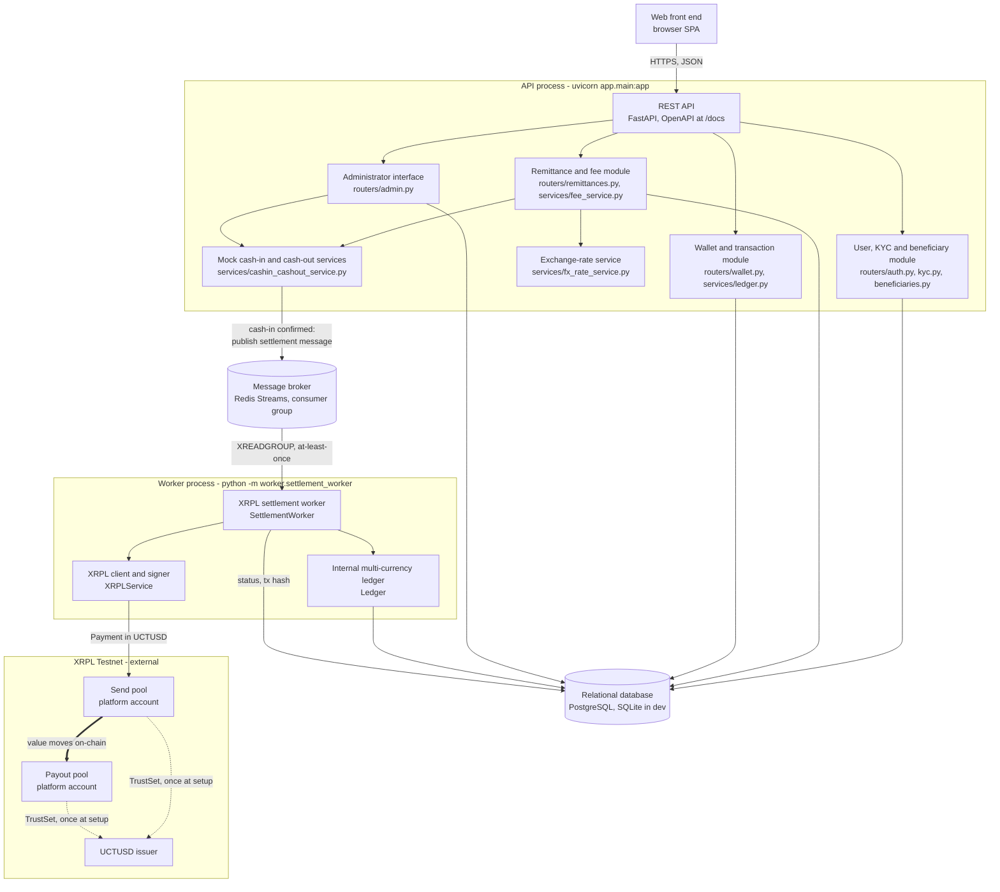

# CrossFX — Business and Technical Specification

*ECO5040W — Financial Software Engineering, UCT — Group 4*
*Ndumiso Zondi (ZNDNDU007) · Marco Klopper (KLPMAR012) · Muki Mdluli (MDLMUK001) · Rafaela Stevenson (STVRAF001)*

> Target length: ~10–15 pages. Fill in each section below as the design solidifies.
> Due alongside the check-in on 18 September.

## 1. Business Problem

*Written by Track 4 (Frontend, Performance & Compliance Docs).*

Remittances are one of the largest financial flows into developing economies,
and one of the most expensive to send. The global average cost of sending the
equivalent of USD 200 sits at roughly 6% of the amount — against a UN
Sustainable Development Goal target of 3% — and sub-Saharan Africa is
consistently the most expensive receiving region in the world. South Africa is
the dominant sending country for the Southern African corridor: migrant workers
from Zimbabwe, Malawi, Mozambique and Lesotho remit rand home regularly, in
small amounts, where a fixed fee bites hardest.

The cost is structural rather than greedy. A traditional transfer moves through
a chain of intermediaries — the sending agent, its bank, one or more
correspondent banks, the receiving institution, the payout agent — each taking a
fee and each adding settlement delay. Correspondent banking requires
pre-funded nostro accounts in the destination currency, which ties up capital
and is priced back into the transfer. The result is a transfer that takes one to
five business days and costs the sender between 5% and 15%, with much of that
cost hidden inside the exchange rate rather than disclosed as a fee.

Three problems follow, and CrossFX is a response to each:

1. **Price opacity.** Most providers advertise "zero fees" and recover the
   margin in a marked-up exchange rate, so the sender cannot tell what they
   actually paid. CrossFX discloses the mid-market rate, the transaction fee and
   the FX margin as three separate figures, plus the all-in effective rate the
   sender is really paying (§4, §5.3).
2. **Settlement latency and cost.** A stablecoin settles value between
   corridor pools in seconds for a fraction of a cent, on a public ledger with a
   verifiable transaction hash, rather than over a multi-day correspondent
   chain. Section §9 implements exactly that leg.
3. **Recipient access.** Many recipients are unbanked. A custodial web wallet
   lets a recipient hold value and convert it to local fiat on their own
   schedule, without needing a bank account (§9.1, §10).

What a stablecoin does **not** solve is equally important, and the rest of this
document is largely about it: cash-in and cash-out still require real fiat
networks, liquidity still has to be funded somewhere, custody still has to be
secured, and every one of the regulatory obligations in §14 still applies. The
settlement instrument changes; the obligations do not.

**Scope.** CrossFX is an academic prototype built to the ECO5040W brief. It
moves no real customer money, holds no production credentials, and operates only
on the XRP Ledger Testnet.

## 2. User Journey

*Written by Track 4 (Frontend, Performance & Compliance Docs).*

The brief's eleven-step journey, mapped to the screen the user is on, the API
call behind it, and the state the remittance ends up in. Two people appear:
**Thandi**, a sender in Cape Town, and **Blessing**, her brother, the recipient.

| # | Step | Screen | Endpoint | Resulting state |
|---|---|---|---|---|
| 1 | Thandi registers and logs in | Register / Log in | `POST /auth/register`, `POST /auth/login` | `kyc_status = not_started` |
| 2 | She completes mock KYC | KYC | `POST /kyc/apply` → admin `POST /admin/kyc/{id}/approve` | `kyc_status = approved`; limits become R3 000 / R25 000 |
| 3 | She adds Blessing as a recipient | Recipients | `POST /beneficiaries/` | A `beneficiaries` row |
| 4 | She enters R1 000 to send | Send money | *(client-side)* | — |
| 5 | The platform retrieves the USD/ZAR rate | Send money | `fx_rate_service.get_usd_zar_rate` (§5) | Rate locked onto the quote |
| 6 | Fees, margin, net and UCTUSD are calculated and shown | Quotation | `POST /remittances/quote` | `quoted`, expiring in 15 minutes |
| 7 | She confirms a simulated ZAR cash-in | Quotation | `POST /remittances/{id}/confirm-cash-in` | `cash_in_confirmed` |
| 8 | A settlement message is queued | *(none — server side)* | `SettlementQueue.publish` | `queued` |
| 9 | A worker transfers UCTUSD on XRPL Testnet | *(none — worker process)* | `SettlementWorker.settle` | `settling` → `settled`, with an XRPL hash |
| 10 | Blessing logs in and sees the UCTUSD | Wallet | `GET /wallet/balance`, `GET /wallet/transactions` | Ledger balance credited |
| 11 | He requests a simulated cash-out | Wallet | `POST /wallet/cash-out` → admin `POST /admin/cash-outs/{id}/approve` | `requested` → `completed`; fiat credited |

Three things about this journey are worth drawing out, because they are design
decisions rather than mechanics:

- **Steps 8 and 9 have no screen.** Once cash-in is confirmed, the sender's
  request has returned; settlement happens behind the queue. The UI polls
  `GET /remittances/{id}` and updates itself. This is the asynchronous boundary
  the brief mandates, and §7.2 explains why the system is built around it.
- **Step 2 is a hard gate.** An unverified sender's limit is R0, so the KYC
  requirement is a consequence of the limit model rather than a separate rule
  (§6). The send screen refuses to render a quote form until KYC is approved.
- **Step 11 does not require Blessing to be KYC-approved.** Gating it would
  make a recipient unable to touch money that is already theirs. In a real
  corridor those checks belong to the payout partner in the destination country
  — see §10.4, and §15, where it is recorded as the prototype's most
  significant AML gap.

**Failure paths the user actually sees.** A quote that expires before cash-in
is refused with a `409` and the sender asked for a new one. A send that would
breach a limit is refused with a `403` naming the period, the ceiling and the
headroom left. A cash-in confirmed while the queue is down returns `200` with
`queued: false` — the money was taken, so the UI shows a "confirmed, settling
shortly" notice rather than an error, because telling a sender their payment
failed invites them to pay twice (§8.2).

## 3. Functional Requirements

*Written by Track 4 (Frontend, Performance & Compliance Docs).*

Every requirement in the brief's Functional Scope, traced to where it is
implemented. `FR-n` numbering is this document's own.

### 3.1 User registration and login

| | Requirement | Implementation |
|---|---|---|
| FR-1 | Register, log in, log out | `routers/auth.py`; JWT, 60-minute expiry |
| FR-2 | Manage basic profile information | `GET /auth/me` |
| FR-3 | View KYC status | `GET /auth/me`, `GET /kyc/status` |
| FR-4 | View transaction limits | `GET /auth/me` returns the applicable pair (§6) |
| FR-5 | View wallet balance and transaction history | `GET /wallet/balance`, `GET /wallet/transactions` |
| FR-6 | Passwords securely hashed, never stored in plaintext | bcrypt via `passlib` (`security/hashing.py`, §13) |

### 3.2 Mock KYC

| | Requirement | Implementation |
|---|---|---|
| FR-7 | Collect the eight prescribed fields | `schemas/kyc.KYCApplicationCreate` — full name, date of birth, nationality, identification number, residential address, mobile number, email, source of funds |
| FR-8 | An administrator may approve or reject | `POST /admin/kyc/{id}/approve`, `/reject` |
| FR-9 | Only approved users may send | `require_kyc_approved` on every sender route, plus R0 limits (§6) |

### 3.3 Beneficiary management

| | Requirement | Implementation |
|---|---|---|
| FR-10 | Add and view beneficiaries | `POST`/`GET /beneficiaries/` |
| FR-11 | Record name, contact, country, payout currency, relationship | `models/beneficiary.py`; `UNIQUE(sender_id, contact)` |

### 3.4 Remittance limits

| | Requirement | Implementation |
|---|---|---|
| FR-12 | Configurable daily and monthly limits | `VERIFIED_*` / `UNVERIFIED_*` in `.env` (§6) |
| FR-13 | Reject a remittance that would exceed either | `limits_service.assert_within_limits` → `403` naming the period and headroom |

### 3.5 Exchange rates and fees

| | Requirement | Implementation |
|---|---|---|
| FR-14 | Use the USD/ZAR rate applicable when the transaction is created | Rate stored on the quote as `fx_rate_used`, honoured for `QUOTE_TTL_MINUTES` (§5.2) |
| FR-15 | Support an API, a mock, or a rate table | All three, selected by `EXCHANGE_RATE_SOURCE` (§5) |
| FR-16 | Quotation shows send amount, rate, fee, margin, UCTUSD received, cash-out fee, estimated payout | All seven returned by `POST /remittances/quote`, plus `effective_rate` (§4.2) |
| FR-17 | Fixed fee, percentage fee, FX margin, cash-out fee | §4; four settings, no hardcoded numbers |
| FR-18 | All fees configurable | `app/config.py`, sourced from `.env` |

### 3.6 Simulated ZAR cash-in

| | Requirement | Implementation |
|---|---|---|
| FR-19 | Simulate payment by agent cash, bank transfer or card | `cash_in_method` ∈ `agent_cash \| bank_transfer \| card` (§8) |
| FR-20 | An administrator or mock payment service may confirm receipt | `POST /admin/remittances/{id}/confirm-payment` |
| FR-21 | The UCTUSD transfer must not begin until cash-in is confirmed | Only `CASH_IN_CONFIRMED`/`QUEUED` are claimable by the worker (§9.5) |

### 3.7 Custodial wallet

| | Requirement | Implementation |
|---|---|---|
| FR-22 | Display balance, incoming, outgoing/cash-out, status, date, XRPL hash | `wallet_transactions` carries all six; rendered on the Wallet screen (§9.4) |
| FR-23 | Choose per-user accounts or one platform wallet with an internal ledger | Pooled custody with an internal multi-currency ledger, justified in §9.1 |
| FR-24 | Trust lines to the issuer | `XRPLService.establish_pool_trustline`, run once per pool at setup |

### 3.8 XRPL Testnet integration

| | Requirement | Implementation |
|---|---|---|
| FR-25 | Testnet account setup | `scripts/init_platform_wallets.py` |
| FR-26 | Token transfer | `XRPLService.send_pooled_payment` |
| FR-27 | Transaction signing | `xrpl-py` `submit_and_wait`, inside `XRPLService` only |
| FR-28 | Transaction submission | as above |
| FR-29 | Transaction-hash storage | `remittances.xrpl_tx_hash`, `wallet_transactions.xrpl_tx_hash` |
| FR-30 | Successful transaction validation | `submit_and_wait` blocks for a validated ledger |
| FR-31 | Failed-transaction handling | Non-`tesSUCCESS` → `XRPLTransactionError` → `FAILED` with the result code (§9.5) |

### 3.9 Message queue

| | Requirement | Implementation |
|---|---|---|
| FR-32 | Process transfers asynchronously through a message queue | Redis Streams consumer group (`services/settlement_queue.py`) |
| FR-33 | The six-step confirm → queue → read → submit → record → credit flow | Mapped step by step in §9.3 |
| FR-34 | Duplicate messages must not credit a recipient twice | Three independent mechanisms (§9.5) |

### 3.10 Private-key security

| | Requirement | Implementation |
|---|---|---|
| FR-35 | Keys in the database must be encrypted | Fernet ciphertext in `platform_wallets.xrpl_encrypted_seed` |
| FR-36 | The encryption key must not live in that database | `PRIVATE_KEY_ENCRYPTION_KEY` in the environment |
| FR-37 | Never returned via the API | `platform_wallets` is exposed by no route |
| FR-38 | Never appear in logs | Failure paths record result codes only |
| FR-39 | Never committed to source control | `.env` and `*.key` are gitignored |
| FR-40 | Decrypted only by the signing component | `decrypt_seed` is called from exactly one function (§13) |

### 3.11 Simulated cash-out

| | Requirement | Implementation |
|---|---|---|
| FR-41 | Cash out to USD or a supported local currency | USD and ZAR (§10.3) |
| FR-42 | Calculate the fiat amount at the applicable rate, less the cash-out fee | `fee_service.calculate_cash_out_payout` |
| FR-43 | Status of requested / approved / completed / failed | `CashOutStatus`, all four (§10.1) |

### 3.12 Non-functional

| | Requirement | Implementation |
|---|---|---|
| FR-44 | Modular architecture on a Python framework | FastAPI, routers/services/models separation (§7) |
| FR-45 | Relational SQL database | PostgreSQL, SQLite in development (§7.4) |
| FR-46 | JSON API, optionally with interactive OpenAPI docs | FastAPI, Swagger UI at `/docs` |
| FR-47 | Web front end | React + Vite SPA in `frontend/` |
| FR-48 | Performance testing across six metrics | `performance-testing/`, all six reported |

## 4. Fee Model

*Written by Track 3 (FX, Fees & Remittance Flow).*

CrossFX charges a sender three things and a recipient one, and every one of them
is a configuration value rather than a constant — the brief requires fees and
limits to be configurable, so they live in `app/config.py` and `.env`, and
nothing in the code hardcodes a number.

| Charge | Setting | Default | Applied to |
|---|---|---|---|
| Fixed transaction fee | `FIXED_REMITTANCE_FEE_ZAR` | R25 | every remittance |
| Percentage transaction fee | `PERCENT_FEE_BPS` | 150 bps (1.50%) | ZAR send amount |
| FX margin | `FX_MARGIN_BPS` | 100 bps (1.00%) | ZAR send amount |
| Cash-out fee | `CASHOUT_FEE_BPS` | 100 bps (1.00%) | UCTUSD being cashed out (§10) |

The fixed component covers the per-transaction cost of the corridor — the agent
network, the XRPL leg, the ledger write — which does not scale with size. The
percentage component covers the risk and float that do. The margin is the spread
on the currency conversion itself, which is how remittance providers actually
make most of their money; naming it as its own line rather than hiding it in the
rate is a deliberate disclosure decision, and the reason for the next paragraph.

### 4.1 The margin is charged once

The margin is deducted from the rand **and the remainder is converted at the
mid-market rate**. An earlier draft of `fee_service.calculate_quote` did both —
deducted `fx_margin_zar` *and* converted at a rate marked up by the same
`FX_MARGIN_BPS` — which billed the same spread twice and made the disclosed
margin line understate what the customer was actually charged. It was fixed, and
`tests/test_fee_service.py::test_margin_is_charged_once_not_twice` exists to stop
it coming back.

So the arithmetic, in order:

```
transaction_fee_zar = FIXED_REMITTANCE_FEE_ZAR + zar_send_amount × PERCENT_FEE_BPS / 10 000
fx_margin_zar       = zar_send_amount × FX_MARGIN_BPS / 10 000
net_converted_zar   = zar_send_amount − transaction_fee_zar − fx_margin_zar
uctusd_amount       = net_converted_zar / usd_zar_rate          ← mid-market, §5
effective_rate      = zar_send_amount / uctusd_amount           ← disclosed all-in rate
```

### 4.2 Worked example

R1 000 at a mid-market rate of 18.50, on the defaults above:

| Line | Amount |
|---|---|
| Send amount | R1 000.00 |
| Transaction fee (R25 + 1.50%) | −R40.00 |
| FX margin (1.00%) | −R10.00 |
| Converted | R950.00 |
| Exchange rate | 18.500000 ZAR/USD |
| **Recipient receives** | **51.351351 UCTUSD** |
| All-in effective rate | 19.473684 ZAR per UCTUSD |
| Estimated cash-out fee (1.00%) | 0.513513 UCTUSD |
| **Estimated USD payout** | **$50.83** |

Total cost to the sender is R50 on R1 000 — 5.0% all-in, against a World Bank
global average of roughly 6.2% for a $200 remittance. Every one of those figures
is returned by `POST /remittances/quote`, because a quotation the customer cannot
decompose is not a disclosure.

### 4.3 Rounding

Fiat is held to two decimal places and UCTUSD to six, matching the column types
(`Numeric(12, 2)` and `Numeric(18, 6)`). Fees round half-up; anything credited to
a customer rounds **down**. That asymmetry is not greed — under pooled custody the
payout pool has to actually cover every claim in the ledger (§9.6), so a fraction
rounded in the customer's favour is a shortfall the platform funds out of nothing.

Where the money ends up: the transaction fee and FX margin stay in the send pool
as rand that was never converted, and the cash-out fee stays as UCTUSD that is
debited from the recipient and credited to no one. Neither is modelled as a
revenue account in this prototype — see §15.

## 5. Exchange-Rate Calculation

*Written by Track 3 (FX, Fees & Remittance Flow).*

One corridor, one pair: **USD/ZAR**, quoted as rand per dollar. UCTUSD is a
USD-denominated IOU, so a UCTUSD amount and a USD amount are the same number, and
USD/ZAR is the only rate the platform needs.

`app/services/fx_rate_service.py` exposes exactly one function,
`get_usd_zar_rate(db)`, and three interchangeable implementations behind it,
selected by `EXCHANGE_RATE_SOURCE`. Callers never change.

| Source | Behaviour | Use |
|---|---|---|
| `mock` *(default)* | Deterministic rate drifting around `FX_MOCK_BASE_RATE` (18.50) by at most `FX_MOCK_VOLATILITY_BPS` (150 bps) | Demo and load tests |
| `api` | A public endpoint (`FX_API_URL`, keyless, USD-base), cached for `FX_RATE_CACHE_SECONDS` | Realism, when there is internet |
| `table` | The most recent `fx_rates` row, written by `python -m scripts.seed_fx_rates` | A pinned rate for marking |

### 5.1 Why the default is a mock, and why it still moves

`performance-testing/README.md` characterises `POST /remittances/quote` as *"pure
compute"*. A quote endpoint that makes an outbound HTTP request per call is not
pure compute — it is a measurement of someone else's API, and it becomes the
bottleneck the load test was meant to measure around. The `mock` source makes the
quote path a few decimal multiplications and one database insert.

A constant, though, demonstrates nothing: half the point of an FX product is that
the rate moves. The mock derives its offset from a SHA-256 hash of the current
cache bucket, which gives a rate that drifts unpredictably between buckets but is
a **pure function of the clock**: two API workers quoting the same second agree,
a restarted process agrees with itself, and a test can pin a rate by pinning the
time. `FX_MOCK_VOLATILITY_BPS=0` flattens it entirely, which is what a scripted
demo wants. The `api` source is cached for the same reason and additionally falls
back to the last good rate when a refresh fails — stale but real beats refusing to
quote because a third party blinked.

### 5.2 The rate is locked at quote time

A quote stores the rate it used in `remittances.fx_rate_used` and is honoured for
`QUOTE_TTL_MINUTES` (15 by default), recorded in `remittances.quote_expires_at`.
Confirming cash-in against an expired quote is refused with `409` and the sender
is asked for a new one; confirming a live quote clears the expiry, because at that
point the figures are committed and there is nothing left to age out.

Fifteen minutes is a judgement call, not a derivation. It is long enough for
someone to walk to an agent, and short enough that the platform is not holding a
one-sided option on the currency for a customer who may never come back.

### 5.3 What is disclosed

`POST /remittances/quote` returns both `fx_rate` — the mid-market rate, with no
margin in it — and `effective_rate`, the all-in rand-per-UCTUSD the sender is
actually paying once the fee and margin are counted. Publishing only the first
would be the standard trick of advertising a good rate and recovering it in fees;
publishing only the second would hide how the price was built. Both, and the two
charge lines between them, is the whole picture.

## 6. Remittance Limits

*Written by Track 3 (FX, Fees & Remittance Flow).*

Every sender has a daily and a monthly ZAR ceiling, set by their KYC status.

| KYC status | Daily | Monthly | Setting |
|---|---|---|---|
| `approved` | R3 000 | R25 000 | `VERIFIED_DAILY_LIMIT` / `VERIFIED_MONTHLY_LIMIT` |
| anything else | R0 | R0 | `UNVERIFIED_DAILY_LIMIT` / `UNVERIFIED_MONTHLY_LIMIT` |

An unverified sender's limit being zero is the point: it makes "you must complete
KYC before sending" a consequence of the limit model rather than a separate rule.
`GET /auth/me` already advertises the applicable pair, and the quote endpoint is
additionally gated on `require_kyc_approved`, so the two can never disagree.

`app/services/limits_service.py` owns the two questions the limits raise that the
numbers above do not answer.

### 6.1 The window is South African, not UTC

Limits are a South African construct denominated in rand, so a sender's "today" is
their today. The window is the calendar day and calendar month at **UTC+02:00**;
under a UTC window the daily limit would reset at 02:00 local, which is the middle
of the evening for anyone sending after work.

SAST is expressed as a fixed offset rather than the `Africa/Johannesburg` zone
because SAST has never observed daylight saving, and a fixed offset needs no
`tzdata` package on the Windows machines the team develops on.

### 6.2 Which remittances consume headroom

| Status | Counts? | Why |
|---|---|---|
| `quoted`, not yet expired | yes | otherwise a sender could take out ten quotes for their full limit and fund all ten |
| `cash_in_confirmed`, `queued`, `settling` | yes | the money has left the sender and is on its way |
| `settled` | yes | it arrived |
| `quoted`, expired | no | they never funded it |
| `failed` | no | no value left the sender |

This is what makes persisting a quote as a `QUOTED` row (rather than computing it
in memory) load-bearing rather than incidental: the row *is* the reservation, and
`quote_expires_at` is what returns the reservation if it is never taken up.

### 6.3 What the sender sees

`assert_within_limits` checks the daily ceiling before the monthly one — it is the
tighter of the two, and "come back tomorrow" is actionable in a way that "come back
next month" is not. A breach is refused with `403` and a message naming the period,
the limit and the headroom remaining, and every successful quote carries a `limits`
block with the same four figures so the quote screen can show a sender where they
stand before they hit the wall.

A `403` rather than a `422` because nothing is wrong with the request: it is
well-formed, from an authenticated and verified sender, and policy is what refuses
it.

## 7. Architecture Diagram

*Diagram and component inventory by Track 2; §7 is Track 4's section to own
and extend (see `docs/work-split.html`).*



### 7.1 Component inventory

| Brief component | Implementation | Track | State |
|---|---|---|---|
| Web front end | `frontend/` — React + Vite SPA | 4 | Done — full sender and recipient journey, plus the admin screens |
| REST API | `app/main.py` (FastAPI, CORS, `/docs`) | 1 | Done |
| Relational database | PostgreSQL; SQLite for dev and CI | 1 | Done |
| User and KYC module | `routers/auth.py`, `kyc.py`, `beneficiaries.py`, `models/user.py`, `kyc.py`, `beneficiary.py` | 1 | Done |
| Remittance and fee module | `routers/remittances.py`, `services/fee_service.py`, `services/limits_service.py`, `models/remittance.py` | 3 | Done |
| Wallet and transaction module | `routers/wallet.py`, `services/ledger.py`, `models/wallet.py` | 2, 3 | Done — balance and history (T2), cash-out (T3) |
| Exchange-rate service | `services/fx_rate_service.py`, `models/fx_rate.py` | 3 | Done — all three sources (§5) |
| Message broker | Redis Streams via `services/settlement_queue.py` | 2 | Done |
| XRPL settlement worker | `worker/settlement_worker.py` | 2 | Done |
| Mock cash-in and cash-out services | `services/cashin_cashout_service.py` | 3 | Done (§8, §10) |
| Administrator interface | `routers/admin.py` | 1, 3 | Done — KYC review (T1), cash-in confirmation and payout review (T3) |

### 7.2 Two processes, one database

The API and the settlement worker are **separate operating-system
processes** that share only the database and the broker. This is the
structural consequence of the brief's requirement that UCTUSD transfers be
processed asynchronously, and it buys three things:

- **The request path never waits on XRPL.** Submitting a payment and waiting
  for a validated ledger takes seconds. A user confirming cash-in gets an
  immediate response; settlement happens behind the queue.
- **They scale independently.** The API is I/O-light per request; the worker
  is dominated by one blocking network round-trip. Several workers can share
  the consumer group, which is what makes Track 4's queue-throughput
  measurement meaningful rather than a measurement of one process.
- **Failure is isolated.** A crashed worker leaves the API serving; its
  unacked messages are replayed when it restarts (§9.5). A crashed API leaves
  in-flight settlements to complete.

The queue is therefore not an optimisation bolted on — it is the boundary the
system is built around.

### 7.3 Trust boundaries

Three boundaries matter, marked by where secrets are allowed to exist:

1. **Browser to API.** Stateless JWTs over HTTPS; passwords are bcrypt-hashed
   and never returned. No secret the client holds can move funds.
2. **API to XRPL.** There isn't one — deliberately. No route in the API
   process can reach a wallet seed, because the only component that decrypts
   one is `XRPLService`, which lives in the worker process (§13). Compromising
   the public API therefore does not reach the signing path.
3. **Application to database.** `platform_wallets` holds the two pool seeds as
   Fernet ciphertext, and `PRIVATE_KEY_ENCRYPTION_KEY` lives outside the
   database. A database dump alone yields no usable key.

Note what users are *not*: they have no XRPL accounts and no key material at
all (§9.1), so the entire private-key attack surface is two rows.

### 7.4 Technology choices

| Choice | Why |
|---|---|
| FastAPI | Brief permits Flask, Django or FastAPI. Pydantic gives request and response validation from type hints, and the OpenAPI `/docs` the brief asks for comes free — which is also how the demo is driven without a finished frontend. |
| PostgreSQL, SQLite in dev | Models use the portable `sqlalchemy.Uuid`, so identical models and migrations run against either. Local development and the test suite need no infrastructure; a deployment points `DATABASE_URL` at Postgres. |
| Alembic | Schema is versioned rather than created by `create_all`, so a schema change is reviewable and reversible. `tests/test_migrations.py` asserts the migration chain matches the models column-for-column. |
| Redis Streams | Of the brokers the brief names, the lightest to run while still providing consumer groups, at-least-once delivery and a pending-entries list — the three properties settlement actually needs. Kafka's ordering and retention guarantees are not needed here. |
| `xrpl-py` | The official Python SDK. `submit_and_wait` autofills fee and sequence, signs, submits and blocks until the transaction is in a validated ledger, which is exactly the "submission and validation" pairing the brief asks to be demonstrated. |

### 7.5 Deployment shape

For the demo everything runs locally: one uvicorn process, one worker process,
one Redis container, one database. The two processes are already separate
programs with no shared memory, so a cloud deployment (Render or Railway, per
the brief) is two services against a managed Postgres and a managed Redis,
with no code change. The worker needs no inbound network access, which is the
right shape for the one component that can move funds.

## 8. Cash-In Flow

*Written by Track 3 (FX, Fees & Remittance Flow).*

Cash-in is where the sender's rand becomes the platform's rand, and it is step 1
of the brief's mandated asynchronous flow (§9.3). It is **simulated**: no payment
rail is touched, and `app/services/cashin_cashout_service.py::simulate_cash_in` is
the seam a real integration would replace.

| Method | `cash_in_method` | Real-world equivalent |
|---|---|---|
| Agent cash | `agent_cash` | Handing notes to a retail agent — the target user, who has no bank account |
| Bank transfer | `bank_transfer` | EFT into the corridor's collection account |
| Card | `card` | Card-funded send through a PSP |

Two endpoints confirm it, and they share one implementation:

- `POST /remittances/{id}/confirm-cash-in` — the sender's own confirmation, which
  is what the demo UI calls;
- `POST /admin/remittances/{id}/confirm-payment` — the mock payment-service hook,
  admin-gated, which is also the manual retry described below.

### 8.1 Sequence

1. **Ownership.** The remittance must belong to the caller, or `404` — not `403`,
   which would confirm the id exists (§13).
2. **State.** Only a `QUOTED` remittance can be funded, and only before its quote
   expires (§5.2). An already-confirmed one is a no-op rather than an error, so a
   double-submitted form does not produce a failure the sender cannot act on.
3. **Recipient check.** The beneficiary's contact must match a registered
   `User.email`, because under pooled custody the credit lands in the recipient's
   internal wallet (§9.1). This is checked **here and not at quote time**: quoting
   is only pricing, but taking a sender's cash for a transfer that provably cannot
   land is the failure worth preventing.
4. **Confirm and commit.** `status → CASH_IN_CONFIRMED`, `cash_in_confirmed_at`
   stamped, `quote_expires_at` cleared. Committed on its own.
5. **Publish and commit.** `SettlementQueue.publish(idempotency_key, id)`, then
   `status → QUEUED`. The message carries identifiers only; the worker re-reads
   every authoritative figure from the row.

### 8.2 Why the two commits are in that order

Publishing before committing the status would let a crash in between leave a
message pointing at a remittance the worker will refuse to claim — a settlement
lost silently. Committing first can only produce the harmless opposite: a
confirmed remittance whose message is missing, which is a state the system can see
and recover from.

So a queue outage does not fail the request. The response returns `200` with
`queued: false`, a `detail` explaining what happened, and the remittance sitting
in `CASH_IN_CONFIRMED` — which is one of the two statuses the worker accepts as
claimable (`settlement_worker.CLAIMABLE`). Re-running the admin confirm-payment
endpoint republishes it once the queue is back. Returning a `503` instead would
have been a lie: the cash-in genuinely was confirmed, and a sender told their
request failed might reasonably pay in twice.

Publishing the same message more than once is safe by construction — the worker
claims each remittance exactly once (§9.5) — so the retry needs no bookkeeping of
its own.

### 8.3 Nothing in the request path touches XRPL

The request returns as soon as the message is on the queue. Settlement latency,
XRPL availability and Testnet congestion are all on the worker's side of that
boundary (§7.2), which is the entire reason the brief mandates a queue here.

## 9. UCTUSD Settlement Flow

*Written by Track 2 (Settlement & Security).*

### 9.1 Custodial model: pooled custody with an internal multi-currency ledger

The brief permits two custodial approaches: a separate XRPL Testnet account per
user, or *"one platform wallet with customer balances maintained in an internal
database ledger."* CrossFX implements the second.

A user has **no on-chain identity at all**. `wallets` is a container row that holds
no address, no seed and no balance; what a user owns is a row per currency in
`ledger_balances` (`app/models/wallet.py`), and every movement of one is an
immutable `wallet_transactions` entry. The only XRPL accounts in the system belong
to the platform.

This is how MoneyGram and Western Union actually operate. Neither opens a bank
account per customer: both hold pooled, for-benefit-of corporate accounts in each
corridor and track individual entitlements in an internal ledger, moving real value
between institutions in bulk. Reproducing that on UCTUSD/XRPL has three concrete
advantages for this prototype:

- **No per-user funding.** Every XRPL account needs an XRP base reserve and a
  TrustSet before it can hold UCTUSD. Per-user accounts would mean funding and
  trust-lining an account per registration, against an UCTUSD Testnet faucet capped
  around $10/24h (see `app/services/xrpl_service.py`).
- **One custody surface.** Two seeds to protect rather than N, which is what makes
  the private-key requirements in §13 tractable rather than aspirational.
- **Multi-currency for free.** A recipient's cash-out converts UCTUSD into USD or a
  local currency. On-chain, that is a second asset to issue and trust-line; in an
  internal ledger it is another row. §9.4.

The cost is honest and recorded in §15: users must trust the platform's ledger,
because there is no per-user on-chain balance for them to verify independently.

### 9.2 Two corridor pools, not one account

Pooled custody is one *model*, but it needs **two** XRPL accounts, held as the two
`platform_wallets` rows (`PoolRole.SEND_POOL`, `PoolRole.PAYOUT_POOL`):

| Pool | Corridor side | Role |
|---|---|---|
| `send_pool` | South Africa | Holds UCTUSD liquidity; signs the outbound Payment |
| `payout_pool` | Payout country | Receives; its balance backs recipients' UCTUSD claims |

The reason is mechanical rather than stylistic. The brief requires the worker to
submit an UCTUSD transfer to XRPL per remittance, and an XRPL `Payment` must have a
destination different from its account — a single platform wallet paying itself is
rejected (`temREDUNDANT`), so it could not produce the per-transaction transaction
hash the brief also requires the wallet to display. Two pooled accounts is the
smallest structure that satisfies both.

It is also the more faithful analogue. A remittance corridor has a collection pool
on the sending side and a disbursement pool on the receiving side; value moves
between them, and the customer's money never crosses the border as its own
transfer. CrossFX's inter-pool leg is a public XRPL transaction with a hash rather
than a correspondent-banking wire — which is the entire argument for using a
stablecoin rail.

### 9.3 Settlement flow

The brief's mandated asynchronous flow, and where each step lives:

| # | Brief step | Implementation |
|---|---|---|
| 1 | ZAR payment is confirmed | `routers/remittances.py::confirm_cash_in` / `routers/admin.py::confirm_zar_payment` — Track 3 |
| 2 | A settlement message is added to the queue | `SettlementQueue.publish` |
| 3 | A worker reads the message | `SettlementWorker.run` |
| 4 | The worker submits the UCTUSD transfer | `SettlementWorker.settle`, on-chain leg |
| 5 | Success or failure is recorded | `SettlementWorker._record_success` / `_fail` |
| 6 | The recipient's wallet balance is updated | `Ledger.credit` |

In detail, per message:

1. **Claim.** A compare-and-swap moves the `Remittance` from `CASH_IN_CONFIRMED`
   (or `QUEUED`) to `SETTLING`. If it does not match, another worker already has
   it or it has already settled — the message is skipped. §9.5.
2. **Resolve.** The recipient user, the send pool and the payout pool are loaded.
   Anything missing fails the remittance here, before anything irreversible.
3. **On-chain leg.** `XRPLService.send_pooled_payment` submits one UCTUSD
   `Payment`, `send_pool → payout_pool`, for the remittance's `uctusd_amount`, and
   waits for validation. The send pool's seed is decrypted inside `xrpl_service`
   and never crosses back out; the worker holds a `PlatformWallet` row, not a key.
4. **Ledger leg**, in a single DB transaction with the remittance stamp:
   - credit the recipient's `UCTUSD` `ledger_balances` row by `uctusd_amount`, and
     write an `incoming` `wallet_transactions` entry carrying the XRPL hash;
   - write the sender an `outgoing` `ZAR` entry — a record, not a balance move,
     because their ZAR went bank/card → send pool and was never a ledger holding
     of theirs (`Ledger.record_external`);
   - set `status = SETTLED`, `settled_at`, `xrpl_tx_hash`, and both treasury
     columns (§9.6).
5. **Ack.** The queue message is acknowledged only after that transaction commits.

The recipient's balance therefore changes only after a validated on-chain payment.
The brief's ordering — submit, record the result, then update the balance — is the
safe ordering too: there is no window in which a user has been credited for value
the pools have not actually moved.

### 9.4 The internal multi-currency ledger

`app/services/ledger.py`'s `Ledger` class is the only way a balance changes
anywhere in the system, and it writes the balance and its audit entry together
or not at all. It is constructed around one database session (`Ledger(db)`) and
never commits — the caller owns the transaction boundary.

- `ledger_balances` — `UNIQUE(wallet_id, currency)`. One row per currency held; the
  balance is a rollup, not a log. `SELECT … FOR UPDATE` serialises concurrent
  workers touching the same recipient (a no-op on SQLite, real on Postgres).
- `wallet_transactions` — immutable entries, so any balance is reconstructible from
  history. Carries `currency`, `direction`, `status`, `xrpl_tx_hash` and
  `failure_reason`, which is exactly the set the brief requires the custodial
  wallet to display.
- Currencies are configurable (`SUPPORTED_CURRENCIES`, default `UCTUSD,USD,ZAR`);
  an unrecognised code is rejected rather than silently creating a new balance.
- `Ledger.credit` / `Ledger.debit` move a balance; `record_external` writes an entry that moves
  none, for legs whose counterparty is outside the ledger — the sender's ZAR, and
  failed settlements, which the recipient should see without being credited.
- Debits are refused below zero (`InsufficientFundsError`), which is already the
  "validate sufficient balance" half of Track 3's cash-out (§10).

Adding a payout currency is a config change, not a schema change — which is the
practical payoff of keeping entitlements in a ledger instead of on-chain.

### 9.5 Idempotency and failure handling

The brief requires that duplicate messages cannot credit a recipient more than
once. Three independent mechanisms, in order of who catches what:

1. **Status compare-and-swap** (`_claim`). Only a remittance awaiting settlement
   can be claimed, and claiming it is a single atomic `UPDATE`. A redelivered
   message finds `SETTLING` or `SETTLED` and is skipped. This is the mechanism that
   actually does the work: at-least-once delivery makes redelivery normal, not
   exceptional.
2. **`UNIQUE(remittance_id, direction, status)`** on `wallet_transactions`. If the
   compare-and-swap were ever bypassed, a second successful credit for the same
   remittance is a constraint violation rather than free money. `status` is part of
   the key so a recorded failure followed by a manual retry stays representable.
3. **`Remittance.idempotency_key`**, unique, carried by the queue message.

Failure handling (brief: *"failed-transaction handling"*):

- A rejected XRPL transaction — anything other than `tesSUCCESS` — raises
  `XRPLTransactionError`, and the worker records `status = FAILED` plus a `failed`
  entry on the recipient's wallet. No balance moves. The result code is logged; the
  seed is not in scope at that point, so there is nothing that could leak.
- A network error, timeout or malformed response is caught just as broadly and
  recorded the same way. A failure is an outcome, never an exception escaping the
  worker: an escaping exception would leave the remittance in `SETTLING` with the
  message unacked, redelivering indefinitely.
- The one case deliberately left unacked is a ledger write that fails *after* a
  successful on-chain payment. The pools have moved value the ledger has not
  recorded, so the message stays pending and the remittance stays in `SETTLING` —
  visible, and requiring reconciliation, rather than quietly resolved either way.
  It is the only state in the system that needs a human.
- A worker that dies mid-settlement leaves its message pending; the next start
  drains those via `read_pending` before taking new work, and the compare-and-swap
  makes the replay safe.

### 9.6 Treasury settlement and netting

`Remittance.treasury_batch_id` and `treasury_settled_at` are stamped by the worker,
because under this design the inter-pool Payment *is* that remittance's treasury
settlement. The batch id is 1:1 with the payment today.

The columns are not redundant. Production corridors do not clear one transaction at
a time: they net accumulated exposure and settle it periodically, so one on-chain
payment covers many remittances that share a `treasury_batch_id`. Keeping the
column means enabling netting is a change to the worker, not a migration. It is
deliberately not implemented here — per-transaction on-chain settlement is what the
brief specifies, and it is also what makes Track 4's per-remittance XRPL timing and
success-rate measurements meaningful.

**Reconciliation.** The invariant is that the sum of every user's UCTUSD
`ledger_balances` equals the payout pool's on-chain UCTUSD balance
(`XRPLService.issued_balance`). A discrepancy means the reconciliation case
above has occurred.

## 10. Cash-Out Flow

*Written by Track 3 (FX, Fees & Remittance Flow).*

The recipient's half of the journey: turning held UCTUSD into fiat. Like cash-in,
the payout rail is simulated — `simulate_cash_out` is where a real bank or agent
instruction would go — but the ledger movements, the state machine and the refund
path are real.

A cash-out is its own record, `cash_outs`, and it belongs to a **user, not a
remittance**. By the time value is cashed out it has been pooled into a single
ledger balance; asking which remittance a particular rand came from is a question
the ledger cannot answer and does not need to.

### 10.1 Sequence

| Step | Endpoint | Effect |
|---|---|---|
| Request | `POST /wallet/cash-out` | Prices the payout, **debits the UCTUSD**, creates a `requested` row |
| Approve | `POST /admin/cash-outs/{id}/approve` | Runs the simulated rail, **credits the fiat**, row → `completed` |
| Reject | `POST /admin/cash-outs/{id}/reject` | Refunds the UCTUSD, row → `failed` with a reason |

Statuses are `requested → approved → completed`, or `requested → failed`. The
`approved` timestamp is recorded even though the simulated rail completes
instantly, so swapping in a real payout partner means returning after approval
rather than restructuring anything.

### 10.2 The token is debited on request, not on approval

This is the load-bearing decision. If the debit waited for approval, a recipient
could open three cash-outs for their whole balance and have all three approved —
each one individually valid at the moment it was checked. Debiting on request
makes the balance itself the lock: the second request simply fails.

`Ledger.debit` refusing to go below zero *is* the brief's "validate sufficient
balance" step; there is no separate check to get out of step with it. A rejection
therefore has to refund, and it does so as a fresh `incoming` entry rather than by
deleting the debit — `wallet_transactions` is an immutable audit trail (§9.4), so a
reversal has to be visible in its own right.

### 10.3 Pricing

The cash-out fee (`CASHOUT_FEE_BPS`, §4) is taken in UCTUSD **before** conversion,
so a recipient pays the same proportion whichever currency they choose; charging
it after conversion would make the fee depend on the payout currency for no reason
a customer could explain. The remainder converts at the current mid-market rate
(§5): 1:1 for USD, and at USD/ZAR for rand.

Payout currencies are narrower than the list a sender may elect for a beneficiary
(`schemas/beneficiary.ALLOWED_PAYOUT_CURRENCIES` also allows EUR and GBP). A
currency can only be paid out if the internal ledger accepts it
(`SUPPORTED_CURRENCIES`) *and* the platform has a rate for it — which today means
**USD and ZAR**. A beneficiary electing EUR still gets a quote; its payout estimate
is expressed in USD rather than invented. UCTUSD is excluded because cashing out
into the token you already hold is a no-op.

### 10.4 Cash-out is not KYC-gated

The sender's endpoints require `require_kyc_approved`; `POST /wallet/cash-out`
requires only authentication. Gating it would make a recipient unable to touch
money that is already theirs, and in a real corridor the recipient's identity
checks belong to the payout partner in the destination country, under that
country's rules — not to the sending-side platform. It is a prototype
simplification either way, and §14 and §15 record it as one.

## 11. Database Design

*Written by Track 1 (Identity & Data). Full detail lives in
[`backend/README.md`](../backend/README.md); this is the spec-facing summary.*

### Entity-relationship overview

```
users ──┬──< kyc_applications  (user_id FK; reviewed_by_admin_id FK, nullable)
        ├──< beneficiaries     (sender_id FK; unique on (sender_id, contact))
        ├──< remittances        (sender_id FK; beneficiary_id FK)
        ├──< cash_outs          (user_id FK; debit/credit_transaction_id FKs, nullable)
        └──── wallets           (user_id FK, unique — one wallet per user)
                  ├──< ledger_balances      (wallet_id FK; unique on (wallet_id, currency))
                  └──< wallet_transactions  (wallet_id FK; remittance_id FK, nullable)

platform_wallets   (standalone — the two pooled XRPL corridor accounts, no user FK)
fx_rates           (standalone — append-only pinned rates for EXCHANGE_RATE_SOURCE=table)
```

Track 3 owns `remittances` (many-to-one off both `users` and `beneficiaries`), plus
`cash_outs` and `fx_rates`, added in migration `b7f4c9e21d08` along with
`remittances.quote_expires_at` / `cash_in_confirmed_at`. A cash-out hangs off `users`
rather than `remittances` — see §10 — and points back at the two
`wallet_transactions` rows behind its debit and its credit, so the audit trail runs
both ways. Track 2 owns the wallet chain and `platform_wallets`: `wallets` and `wallet_transactions` were
part of the initial migration for a single shared baseline, and `ledger_balances` /
`platform_wallets` arrived with the move to pooled custody (§9.1) in migration
`f20b2cb74a0f`, which also stripped `wallets` down to a container — a user has no
balance column and no on-chain identity. See §9.4 for the ledger's design.

### Tables (Track 1's four)

| Table | Purpose | Key constraints |
|---|---|---|
| `users` | Account, credentials, KYC status, admin flag | `email` unique+indexed; `kyc_status` enum (not_started/pending/approved/rejected); `is_admin` bool |
| `kyc_applications` | One mock KYC submission per review cycle | FK `user_id → users.id`; FK `reviewed_by_admin_id → users.id` (nullable); `status` enum (pending/approved/rejected) |
| `beneficiaries` | Recipients a sender has registered | FK `sender_id → users.id`; `UNIQUE(sender_id, contact)` — stops duplicate recipient entries |
| (migration also creates `wallets`, `wallet_transactions`, `remittances` — Tracks 2/3) | | |

### Design decisions

- **Two status enums, not one.** `User.kyc_status` (`KYCStatus`) includes a
  `NOT_STARTED` member for a user who has never applied; `KYCApplication.status`
  (`ApplicationStatus`) does not, because an application row only ever exists once
  submitted. `routers/admin.py`'s approve/reject endpoints are what keep the two
  columns in sync — approving an application also flips the owning user's
  `kyc_status`, in the same DB transaction.
- **Portable UUID primary keys.** Every table uses `sqlalchemy.Uuid` rather than the
  Postgres-only `sqlalchemy.dialects.postgresql.UUID`. `Uuid` compiles to a native
  `uuid` column on Postgres and a `CHAR(32)` column on SQLite, so the exact same models
  and Alembic migrations run against either backend — which is what lets local
  development and CI run entirely on SQLite with zero infrastructure while a deployed
  environment still points `DATABASE_URL` at Postgres.
- **`UNIQUE(sender_id, contact)` on beneficiaries**, not a global unique on `contact` —
  two different senders are allowed to send to the same recipient contact; one sender
  registering the same contact twice is the accidental-duplicate case being guarded
  against.
- **Admin is a boolean column, not a separate table or claim.** Simpler than a roles
  table for a prototype with exactly one elevated role; no API route can set it (see
  `backend/scripts/create_admin.py`), so it can't be self-granted by a compromised
  account.
- **Schema is managed by Alembic, not `create_all`.** `backend/migrations/` holds the
  migration history; `backend/migrations/env.py` reads the DB URL from
  `app.config.settings` so there is one source of config truth rather than a second
  copy in `alembic.ini`.

## 12. API Overview

*Auth/KYC/beneficiary/admin rows below are Track 1's; the remittance, wallet and
cash-out rows were filled in by Track 3 as those endpoints landed. "user, KYC"
means the route is gated on `require_kyc_approved`.*

| Method | Path | Auth | Purpose |
|---|---|---|---|
| POST | `/auth/register` | — | Create a sender account |
| POST | `/auth/login` | — | JSON credential login, returns a JWT |
| POST | `/auth/token` | — | OAuth2-form login (Swagger's Authorize button only) |
| POST | `/auth/logout` | — | Client-side token discard (stateless JWTs, nothing to revoke) |
| GET | `/auth/me` | user | Profile, KYC status, applicable transaction limits |
| POST | `/kyc/apply` | user | Submit a mock KYC application |
| GET | `/kyc/status` | user | Current KYC status + latest application |
| POST | `/beneficiaries/` | user | Register a recipient |
| GET | `/beneficiaries/` | user | List the caller's own recipients |
| GET, DELETE | `/beneficiaries/{id}` | user | Read/remove a recipient (404, not 403, if it isn't the caller's) |
| GET | `/admin/kyc/applications` | admin | KYC review queue |
| POST | `/admin/kyc/{id}/approve`, `/reject` | admin | Review a KYC application |
| POST | `/admin/remittances/{id}/confirm-payment` | admin | Mock payment-service cash-in confirmation, and the republish retry (§8.2) |
| GET | `/admin/cash-outs` | admin | Payout queue, oldest first; filterable by `?status=` |
| POST | `/admin/cash-outs/{id}/approve` | admin | Release a payout: credits the fiat leg (§10) |
| POST | `/admin/cash-outs/{id}/reject` | admin | Refuse a payout and refund the reserved UCTUSD (§10.2) |
| GET | `/wallet/balance` | user | UCTUSD balance plus the full multi-currency ledger view (§9.4) |
| GET | `/wallet/transactions` | user | Incoming/outgoing history: currency, amount, status, date, XRPL hash |
| POST | `/wallet/cash-out` | user | Request a fiat payout; debits UCTUSD immediately (§10.2) |
| GET | `/wallet/cash-outs` | user | The caller's own cash-outs, newest first |
| GET | `/wallet/cash-outs/{id}` | user | One cash-out (404, not 403, if it isn't the caller's) |
| POST | `/remittances/quote` | user, KYC | Price a send and persist it as a `quoted` remittance (§4–§6) |
| POST | `/remittances/{id}/confirm-cash-in` | user, KYC | Confirm ZAR received, then queue settlement (§8) |
| GET | `/remittances/` | user, KYC | The sender's transaction history, newest first |
| GET | `/remittances/{id}` | user, KYC | Status, and the XRPL hash once settled |

`platform_wallets` is deliberately absent from this table: it is reachable from no
route at all (§13).

## 13. Security Design

- **Password hashing:** bcrypt via `passlib` (`app/security/hashing.py`).
- **No per-user key material at all.** Pooled custody (§9.1) means users have no XRPL
  accounts, so there are no per-user seeds to store, encrypt, rotate or leak. The
  entire private-key attack surface is two rows in `platform_wallets`. The trade-off
  is concentration rather than reduction — compromise of the send pool's seed threatens
  the pooled liquidity — which is what the next three controls are for.
- **Private-key encryption at rest.** Both pool seeds are stored as Fernet ciphertext
  (`app/security/encryption.py`) in `platform_wallets.xrpl_encrypted_seed`. The key
  lives in `PRIVATE_KEY_ENCRYPTION_KEY` (`.env`, and a secrets manager in anything
  beyond an academic prototype) and never in the database holding the ciphertext, which
  is the brief's explicit requirement. Note the ordering this forces: the seeds are
  generated by `scripts/init_platform_wallets.py`, printed once, and encrypted before
  they are ever persisted — there is no point at which a plaintext seed sits in the DB
  waiting to be encrypted, and none in `.env` either.
- **Decryption happens in exactly one module.** `app/services/xrpl_service.py` is the
  signing component, and `_seed_for()` is the only call to `decrypt_seed` in the
  codebase — the brief's *"only be decrypted by the component responsible for signing
  XRPL transactions"*, arranged so it is checkable by grep rather than by trust.
  Callers, including the settlement worker, pass a `PlatformWallet` row in and get a
  transaction hash back; no seed crosses that boundary in either direction. A test
  asserts the worker never passes a seed string (`tests/test_settlement_worker.py`).
- **No route can reach a seed.** `platform_wallets` is not exposed by any router, and
  the wallet schemas (`app/schemas/wallet.py`) contain no address or seed field — under
  pooled custody there is nothing per-user to expose. Seeds are never logged: the
  worker's failure path records XRPL result codes and internal messages only, and
  operates outside the scope where a decrypted seed exists.
- **Authentication:** stateless JWTs (`HS256`), 60-minute expiry, `sub`/`iat`/`exp`
  claims only. No refresh tokens and no server-side revocation — a limitation, recorded
  in §15, not hidden.
- **No user-enumeration via login.** `/auth/login` returns the identical
  `401 {"detail": "Incorrect email or password"}` whether the email doesn't exist or
  the password is wrong, so failed logins can't be used to discover which emails are
  registered.
- **Authorization boundary returns 404, not 403.** Reading or deleting another sender's
  beneficiary returns 404 — a 403 would confirm the record exists under someone else's
  account, which is itself information disclosure.
- **Admin access** is a boolean flag on `User`, checked by a single
  `app.dependencies.require_admin` dependency on every admin route. No API endpoint can
  grant it — it's set only via a local CLI script — so a compromised regular account
  cannot self-promote.
- **KYC PII is not encrypted at rest** in this prototype (see §15) — identification
  numbers and addresses are plain columns. Flagged as a gap against POPIA rather than
  assumed away; see §14.

## 14. Regulatory Considerations

*Written by Track 4 (Frontend, Performance & Compliance Docs).*

This is not a legal opinion. It is an account of which obligations a real
South African remittance business would carry, what CrossFX implements towards
each, and — more usefully for marking — what it does not. The organising point
is the one the brief asks students to demonstrate: **settling in a stablecoin
changes the instrument, not the obligations.** A cross-border transfer of value
for a customer is a regulated activity in South Africa regardless of whether
the rail is SWIFT or the XRP Ledger.

### 14.1 KYC and anti-money-laundering

The Financial Intelligence Centre Act 38 of 2001 (FICA) requires accountable
institutions to identify and verify customers, keep records, and report to the
Financial Intelligence Centre. Crypto asset service providers were added to
FICA's Schedule 1 list of accountable institutions in December 2022, which
settles the question for a business like this one: it would be an accountable
institution.

CrossFX collects the eight identity fields the brief prescribes and gates
sending on administrator approval (§3.2). What it does not do is *verify* any
of them — there is no check against the Department of Home Affairs, no document
capture, no sanctions or politically-exposed-person screening, and no
risk-based customer due diligence tiering. It also does not deduplicate on
identification number, so one person can hold two accounts and two sets of
limits (§15). A real deployment would need all of this before taking a
customer.

### 14.2 Transaction monitoring

FICA obliges an accountable institution to report suspicious and unusual
transactions, and cash threshold reports above the prescribed amount. That
obligation is continuous, not a one-off check at onboarding: it requires
monitoring patterns — structuring just under limits, unusual velocity, many
senders paying one beneficiary.

CrossFX has the raw material for this and none of the logic. Every remittance,
ledger movement and cash-out is an immutable, timestamped, attributable record
(§9.4), which is the hard part of building monitoring on top. But no rule
engine, alerting or reporting exists, and nothing detects the structuring that
the R3 000 daily limit would otherwise invite.

### 14.3 Customer transaction limits

Limits serve two masters: exchange control (§14.6) and AML risk appetite. The
R3 000 daily and R25 000 monthly ceilings in §6 are the brief's illustrative
figures, not derived from a regulation. They are enforced server-side, per
sender, over a South African calendar day and month, and an unverified sender's
ceiling is zero. The gap is that they are per *account* rather than per
*identity* (§15) — which is exactly the weakness real KYC deduplication exists
to close.

### 14.4 Protection of customer information

The Protection of Personal Information Act 4 of 2013 (POPIA) governs the
identity data CrossFX collects, and §14.1's data set is precisely what POPIA
treats as personal information. Section 19's requirement to secure the
integrity and confidentiality of personal information through appropriate
technical measures is the relevant one here.

CrossFX partially meets this: passwords are bcrypt-hashed, transport would be
HTTPS in deployment, authorisation failures return `404` rather than confirming
that another user's record exists, and access is authenticated throughout.
**It does not encrypt KYC PII at rest** — identification numbers and residential
addresses are plain columns (§13). That is the prototype's clearest POPIA gap,
and it is recorded rather than assumed away. POPIA's further obligations —
purpose limitation, retention periods, data subject access and deletion rights,
and breach notification to the Information Regulator — are not implemented at
all.

### 14.5 Custody of crypto assets and safeguarding of customer funds

CrossFX holds customer value in two pooled XRPL accounts and records
entitlements in an internal ledger (§9.1). This is the same shape as a
money transfer operator holding pooled for-benefit-of accounts, and it carries
the same core obligation: the pool must always cover the sum of customer
claims. §9.6 states that invariant and gives the reconciliation check for it.

Three real-world requirements are absent. First, **segregation**: customer
funds should be legally separated from the operator's own, typically in a trust
account, so customers rank ahead of general creditors on insolvency. CrossFX
has no such separation — indeed it has no revenue account at all (§15).
Second, **key management**: two Fernet-encrypted seeds with the key in an
environment variable is appropriate for a prototype, but institutional custody
would use an HSM or a multi-party-computation scheme with multiple signatories,
so that no single compromise moves funds. Third, **the customer cannot verify
their own holding** — their balance is a database row, not an on-chain position
(§15). Pooled custody buys operational simplicity by requiring trust in the
operator, which is the central trade-off of the whole design.

### 14.6 Foreign exchange and capital-flow controls

South Africa operates exchange control under the Currency and Exchanges Act 9
of 1933 and the Exchange Control Regulations, administered by the SARB's
Financial Surveillance Department. Cross-border transfers are made through
Authorised Dealers (banks) or Authorised Dealers with Limited Authority
(ADLAs), the category most money transfer operators fall into. Residents are
subject to annual allowances — a single discretionary allowance and, with tax
clearance, a larger foreign capital allowance — and every cross-border
transaction must be reported to the SARB for balance-of-payments purposes,
against a reporting category.

This is where a stablecoin corridor is least settled and most consequential.
Moving value out of South Africa as a crypto asset rather than as currency does
not place it outside exchange control, and the treatment of crypto assets in
this framework has been the subject of ongoing work by the Intergovernmental
Fintech Working Group rather than a single settled rule. A real CrossFX would
need ADLA authorisation or a sponsoring Authorised Dealer, would have to apply
the allowance framework per customer, and would have to submit BoP reporting on
every transfer.

CrossFX implements none of this. It applies limits, but they are business
limits rather than the statutory allowances, and it produces no regulatory
reporting.

### 14.7 Stablecoin and crypto-asset regulation

The FSCA declared crypto assets a financial product under the Financial
Advisory and Intermediary Services Act in October 2022, bringing crypto asset
service providers into the FAIS licensing regime. The settlement asset itself
matters too: a fiat-referenced stablecoin is a liability of its issuer, so a
platform settling in one carries issuer credit risk and, in a production
setting, would have to assess the issuer's reserve backing, attestation
practice and its powers of freeze and clawback over holders' balances.

CrossFX settles in UCTUSD, a lecturer-issued Testnet IOU, precisely because
this is an academic exercise with no real value at stake (§15). The issuer and
currency code are configuration rather than constants, which is the right
shape: an operator that could not change settlement asset without a rewrite
would be badly exposed to a single issuer.

### 14.8 Consumer protection

The Consumer Protection Act 68 of 2008 and the FSCA's market conduct framework
require, among other things, that pricing be disclosed plainly and that
customers not be misled. Remittance's characteristic conduct failure is
advertising "no fees" while recovering the margin inside the exchange rate.

This is the one area where CrossFX substantially *does* meet the standard, and
deliberately so. The quotation discloses the mid-market rate, the transaction
fee and the FX margin as separate lines, plus the all-in effective rate and the
estimated amount the recipient will actually receive (§4.2, §5.3). Limit
refusals name the limit and the headroom rather than failing opaquely. What is
missing is the rest of the conduct apparatus: terms and conditions, a
complaints and dispute-resolution process, an ombud scheme, and a mechanism
for errors or reversals.

### 14.9 Licensing

Consolidating the above, a real CrossFX would need, at minimum: registration
as an accountable institution under FICA; authorisation from the SARB's
Financial Surveillance Department as an ADLA or a sponsoring relationship with
an Authorised Dealer; an FSP licence from the FSCA for crypto asset services;
and, depending on how it settles and whether it issues anything resembling
e-money, engagement with the National Payment System Act 78 of 1998 framework,
under which SARB restricts participation in the payment system and under which
e-money may be issued only by banks. South Africa's greylisting by the FATF in
2023 and the subsequent remediation effort also sharpened supervisory
expectations on exactly this sector.

None of this is obtainable by a student project, which is the honest summary of
§14: CrossFX demonstrates the *technical* shape of a compliant remittance
platform — identity, limits, auditability, disclosure, custody separation —
while implementing essentially none of the *regulatory* obligations that would
make it lawful to operate.

## 15. Assumptions and Limitations

*Track 2's entries first, then Track 3's; remaining tracks add their own below.*

- **The settlement asset is UCTUSD, which is what the brief's RLUSD requirement
  is satisfied with.** The course distributes liquidity in `UCTUSD`, a
  lecturer-issued XRPL Testnet IOU (announcement of 2026-09-08; issuer
  `rELez4x4Zqv3KYqboYVfrYPF8521Ycbxa5`, currency code
  `5543545553440000000000000000000000000000`), and the brief permits a
  "lecturer-approved test token" in place of RLUSD. This is a substitution of
  instrument only, not of design: an issued currency on XRPL behaves identically
  whichever it is, requiring a TrustSet before an account can hold it and moving
  through the same `Payment` transaction. Everything in the codebase is therefore
  named for UCTUSD, and the issuer and currency code are injected into
  `XRPLService` from `UCTUSD_ISSUER_ADDRESS` / `UCTUSD_CURRENCY_CODE`, so the
  settlement token can be changed without touching code. Note the 40-character hex
  currency code — `UCTUSD` is six characters, and only 3-character ISO-style codes
  may be given literally on XRPL.
- **Pool liquidity is still the binding constraint on any demo.** The send pool holds
  only what the course distributor (`rsWPX7FKwnfk6enosumAzEuTs5Y12Steq4`) has sent it,
  so demo remittances must be sized against that balance rather than assumed. Each
  TrustSet also locks 1 XRP of the signing account's reserve, which the XRP faucet
  covers.
- **Users must trust the internal ledger.** This is the inherent cost of pooled
  custody (§9.1): a recipient cannot independently verify their own balance on-chain,
  because their entitlement is a database row. The mitigation is the reconciliation
  invariant in §9.6, not cryptographic proof.
- **The recipient is matched to a beneficiary by email.** `Beneficiary.contact` is
  matched against `User.email` to decide whose wallet to credit
  (`settlement_worker._resolve_recipient`). A beneficiary who has not registered yet
  cannot be credited, and one who registered under a different address than the sender
  typed will not be found — in both cases the remittance fails cleanly rather than
  crediting the wrong person. The fix is a nullable `recipient_user_id` FK on
  `beneficiaries` (Track 1's file).
- **Netting is designed but not implemented.** Settlement is one on-chain payment per
  remittance, per the brief. Production corridors net; see §9.6 for why the columns
  exist anyway.
- **One reconciliation state needs a human.** A ledger write that fails after a
  successful on-chain payment leaves a remittance in `SETTLING` with its queue message
  unacked (§9.5). There is no automated repair for it.
- **No refresh tokens and no server-side JWT revocation** (§13) — a logged-out token
  stays valid until it expires.
- **KYC PII is not encrypted at rest** (§13, §14) — identification numbers and
  addresses are plain columns.

- **Fee revenue is not modelled as an account.** Transaction fees and the FX margin
  stay in the send pool as rand that was never converted; the cash-out fee is UCTUSD
  debited from a recipient and credited to nobody. The money is correct at every
  step, but there is no platform revenue ledger to reconcile it against (§4.3).
- **Payouts settle instantly because nothing actually pays out.** `simulate_cash_out`
  approves and completes in one call (§10.1). A real payout partner would introduce a
  genuine `approved`-but-not-yet-paid window, and with it settlement risk this
  prototype does not model.
- **One corridor, one currency pair.** Everything assumes ZAR in and USD/ZAR
  pricing (§5). A second corridor would need a rate per pair and a
  `currency_pair`-aware `fx_rates` lookup — which the table is already shaped for,
  but the service is not.
- **Cash-out is not gated on recipient KYC** (§10.4) — a recipient can move value
  out with only an account. In a real corridor this is the payout partner's
  obligation under the destination country's rules, and it is the most significant
  AML gap in the prototype.
- **Limits are enforced per user, not per identity.** Nothing stops one person
  registering twice under two email addresses and getting two sets of limits (§6).
  Real KYC deduplicates on identification number; this prototype's mock KYC does not.

*Track 4's entries follow.*

- **End-to-end settlement is demonstrated, but on a small sample.** Both pooled
  wallets exist on Testnet with established trust lines, and 22 settlements were
  submitted to the real ledger: 12 against an unfunded send pool, all correctly
  rejected `tecPATH_DRY` and recorded as `FAILED` with no credit, and 10 after
  the pool was funded, all `tesSUCCESS` with the recipients credited. The
  reconciliation invariant in §9.6 was then verified to hold exactly — the payout
  pool's on-chain balance equalled the sum of internal claims to six decimal
  places. Both halves of the brief's XRPL requirement are therefore evidenced
  against the live ledger rather than a mock, but 10 successes is a
  demonstration, not a sustained soak test.
- **Settlement liquidity is finite and manually replenished.** The send pool
  was funded by a one-off transfer from the course distributor. Nothing in the
  system monitors the pool balance, warns as it depletes, or refuses to quote a
  remittance the pool could not actually settle — so under sustained use
  CrossFX would keep accepting cash-in and then fail settlements with
  `tecPATH_DRY`, exactly as the first 12 attempts did. A production corridor
  would treat pool balance as a pre-quote precondition and alarm on it.
- **The frontend stores its JWT in `localStorage`.** That is readable by any
  script running on the page, so a cross-site scripting flaw would yield a
  usable token. A production build would use an httpOnly, `Secure`,
  `SameSite` cookie, with CSRF protection. The prototype accepts the risk
  because it has no third-party scripts and runs only on localhost.
- **The frontend infers admin status by probing an admin endpoint.**
  `GET /auth/me` does not return `is_admin` (`schemas/user.py`), so the client
  calls the KYC review queue once at login and treats a `403` as "not an
  admin". This is cosmetic only — every admin route is enforced server-side by
  `require_admin` — but it costs a request per login and is the wrong place for
  the decision. The fix is one field on `MeResponse`.
- **No automated frontend tests.** The backend has a substantial suite; the
  React app has none. It was verified by driving the full journey manually and
  by an end-to-end check against every endpoint the client calls.
- **Performance figures are single-machine and single-worker.** Client, API,
  worker, Redis and SQLite all shared one laptop, so the load generator
  competed with the server for CPU and the measured ceiling of ~84 req/s
  understates the API. The claim that settlement throughput scales with worker
  count is architecturally sound (a Redis consumer group with competing
  consumers) but was not measured with more than one worker.
- **SQLite was never pushed to its limit.** The load tests ran against SQLite
  and found no lock contention at 84 req/s, so the database was not the
  bottleneck at this scale and the Postgres parity claimed in §7.4 remains
  model-level rather than load-verified.
- **Statutory references in §14 are stated as at the time of writing** and
  should be checked against current sources before the document is relied on
  for anything beyond this assignment. Regulation of crypto assets in South
  Africa has moved repeatedly over the past several years and is still moving.
