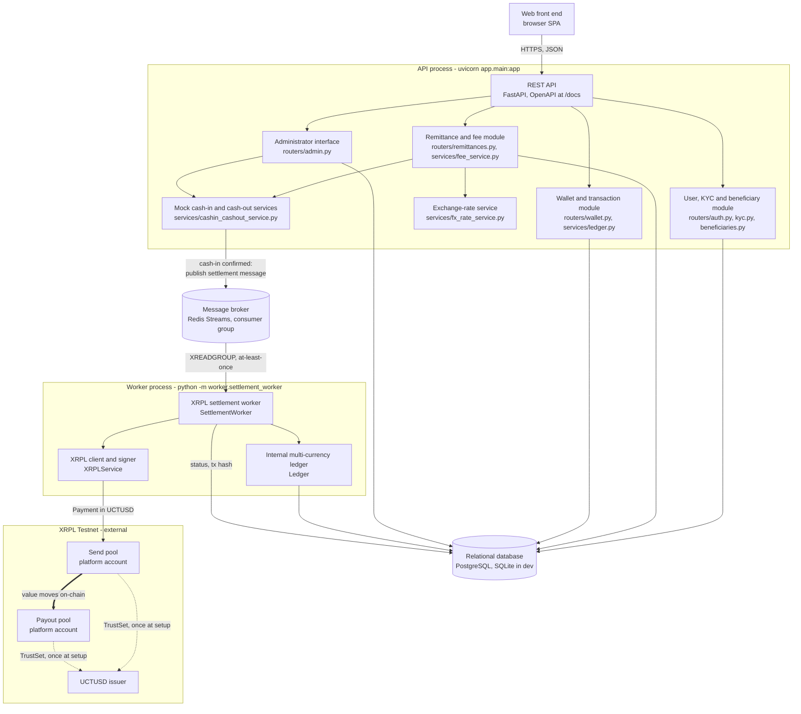

# CrossFX — Business and Technical Specification

*ECO5040W — Financial Software Engineering, UCT — Group 4*
*Ndumiso Zondi (ZNDNDU007) · Marco Klopper (KLPMAR012) · Muki Mdluli (MDLMUK001) · Rafaela Stevenson (STVRAF001)*

> Target length: ~10–15 pages. Fill in each section below as the design solidifies.
> Due alongside the check-in on 18 September.

## 1. Business Problem

## 2. User Journey

## 3. Functional Requirements

## 4. Fee Model

## 5. Exchange-Rate Calculation

## 6. Remittance Limits

## 7. Architecture Diagram

*Diagram and component inventory by Track 2; §7 is Track 4's section to own
and extend (see `docs/work-split.html`).*



### 7.1 Component inventory

| Brief component | Implementation | Track | State |
|---|---|---|---|
| Web front end | `frontend/` | 4 | Not started |
| REST API | `app/main.py` (FastAPI, CORS, `/docs`) | 1 | Done |
| Relational database | PostgreSQL; SQLite for dev and CI | 1 | Done |
| User and KYC module | `routers/auth.py`, `kyc.py`, `beneficiaries.py`, `models/user.py`, `kyc.py`, `beneficiary.py` | 1 | Done |
| Remittance and fee module | `routers/remittances.py`, `services/fee_service.py`, `models/remittance.py` | 3 | Fee math done; endpoints outstanding |
| Wallet and transaction module | `routers/wallet.py`, `services/ledger.py`, `models/wallet.py` | 2 | Balance and history done; cash-out awaits Track 3 |
| Exchange-rate service | `services/fx_rate_service.py` | 3 | Mock returns a fixed rate; API and table modes outstanding |
| Message broker | Redis Streams via `services/settlement_queue.py` | 2 | Done |
| XRPL settlement worker | `worker/settlement_worker.py` | 2 | Done |
| Mock cash-in and cash-out services | `services/cashin_cashout_service.py` | 3 | Not started |
| Administrator interface | `routers/admin.py` | 1 | KYC review done; two bodies await Track 3 |

### 7.2 Two processes, one database

The API and the settlement worker are **separate operating-system
processes** that share only the database and the broker. This is the
structural consequence of the brief's requirement that UCTUSD transfers be
processed asynchronously, and it buys three things:

- **The request path never waits on XRPL.** Submitting a payment and waiting
  for a validated ledger takes seconds. A user confirming cash-in gets an
  immediate response; settlement happens behind the queue.
- **They scale independently.** The API is I/O-light per request; the worker
  is dominated by one blocking network round-trip. Several workers can share
  the consumer group, which is what makes Track 4's queue-throughput
  measurement meaningful rather than a measurement of one process.
- **Failure is isolated.** A crashed worker leaves the API serving; its
  unacked messages are replayed when it restarts (§9.5). A crashed API leaves
  in-flight settlements to complete.

The queue is therefore not an optimisation bolted on — it is the boundary the
system is built around.

### 7.3 Trust boundaries

Three boundaries matter, marked by where secrets are allowed to exist:

1. **Browser to API.** Stateless JWTs over HTTPS; passwords are bcrypt-hashed
   and never returned. No secret the client holds can move funds.
2. **API to XRPL.** There isn't one — deliberately. No route in the API
   process can reach a wallet seed, because the only component that decrypts
   one is `XRPLService`, which lives in the worker process (§13). Compromising
   the public API therefore does not reach the signing path.
3. **Application to database.** `platform_wallets` holds the two pool seeds as
   Fernet ciphertext, and `PRIVATE_KEY_ENCRYPTION_KEY` lives outside the
   database. A database dump alone yields no usable key.

Note what users are *not*: they have no XRPL accounts and no key material at
all (§9.1), so the entire private-key attack surface is two rows.

### 7.4 Technology choices

| Choice | Why |
|---|---|
| FastAPI | Brief permits Flask, Django or FastAPI. Pydantic gives request and response validation from type hints, and the OpenAPI `/docs` the brief asks for comes free — which is also how the demo is driven without a finished frontend. |
| PostgreSQL, SQLite in dev | Models use the portable `sqlalchemy.Uuid`, so identical models and migrations run against either. Local development and the test suite need no infrastructure; a deployment points `DATABASE_URL` at Postgres. |
| Alembic | Schema is versioned rather than created by `create_all`, so a schema change is reviewable and reversible. `tests/test_migrations.py` asserts the migration chain matches the models column-for-column. |
| Redis Streams | Of the brokers the brief names, the lightest to run while still providing consumer groups, at-least-once delivery and a pending-entries list — the three properties settlement actually needs. Kafka's ordering and retention guarantees are not needed here. |
| `xrpl-py` | The official Python SDK. `submit_and_wait` autofills fee and sequence, signs, submits and blocks until the transaction is in a validated ledger, which is exactly the "submission and validation" pairing the brief asks to be demonstrated. |

### 7.5 Deployment shape

For the demo everything runs locally: one uvicorn process, one worker process,
one Redis container, one database. The two processes are already separate
programs with no shared memory, so a cloud deployment (Render or Railway, per
the brief) is two services against a managed Postgres and a managed Redis,
with no code change. The worker needs no inbound network access, which is the
right shape for the one component that can move funds.

## 8. Cash-In Flow

## 9. UCTUSD Settlement Flow

*Written by Track 2 (Settlement & Security).*

### 9.1 Custodial model: pooled custody with an internal multi-currency ledger

The brief permits two custodial approaches: a separate XRPL Testnet account per
user, or *"one platform wallet with customer balances maintained in an internal
database ledger."* CrossFX implements the second.

A user has **no on-chain identity at all**. `wallets` is a container row that holds
no address, no seed and no balance; what a user owns is a row per currency in
`ledger_balances` (`app/models/wallet.py`), and every movement of one is an
immutable `wallet_transactions` entry. The only XRPL accounts in the system belong
to the platform.

This is how MoneyGram and Western Union actually operate. Neither opens a bank
account per customer: both hold pooled, for-benefit-of corporate accounts in each
corridor and track individual entitlements in an internal ledger, moving real value
between institutions in bulk. Reproducing that on UCTUSD/XRPL has three concrete
advantages for this prototype:

- **No per-user funding.** Every XRPL account needs an XRP base reserve and a
  TrustSet before it can hold UCTUSD. Per-user accounts would mean funding and
  trust-lining an account per registration, against an UCTUSD Testnet faucet capped
  around $10/24h (see `app/services/xrpl_service.py`).
- **One custody surface.** Two seeds to protect rather than N, which is what makes
  the private-key requirements in §13 tractable rather than aspirational.
- **Multi-currency for free.** A recipient's cash-out converts UCTUSD into USD or a
  local currency. On-chain, that is a second asset to issue and trust-line; in an
  internal ledger it is another row. §9.4.

The cost is honest and recorded in §15: users must trust the platform's ledger,
because there is no per-user on-chain balance for them to verify independently.

### 9.2 Two corridor pools, not one account

Pooled custody is one *model*, but it needs **two** XRPL accounts, held as the two
`platform_wallets` rows (`PoolRole.SEND_POOL`, `PoolRole.PAYOUT_POOL`):

| Pool | Corridor side | Role |
|---|---|---|
| `send_pool` | South Africa | Holds UCTUSD liquidity; signs the outbound Payment |
| `payout_pool` | Payout country | Receives; its balance backs recipients' UCTUSD claims |

The reason is mechanical rather than stylistic. The brief requires the worker to
submit an UCTUSD transfer to XRPL per remittance, and an XRPL `Payment` must have a
destination different from its account — a single platform wallet paying itself is
rejected (`temREDUNDANT`), so it could not produce the per-transaction transaction
hash the brief also requires the wallet to display. Two pooled accounts is the
smallest structure that satisfies both.

It is also the more faithful analogue. A remittance corridor has a collection pool
on the sending side and a disbursement pool on the receiving side; value moves
between them, and the customer's money never crosses the border as its own
transfer. CrossFX's inter-pool leg is a public XRPL transaction with a hash rather
than a correspondent-banking wire — which is the entire argument for using a
stablecoin rail.

### 9.3 Settlement flow

The brief's mandated asynchronous flow, and where each step lives:

| # | Brief step | Implementation |
|---|---|---|
| 1 | ZAR payment is confirmed | `routers/remittances.py::confirm_cash_in` / `routers/admin.py::confirm_zar_payment` — Track 3 |
| 2 | A settlement message is added to the queue | `SettlementQueue.publish` |
| 3 | A worker reads the message | `SettlementWorker.run` |
| 4 | The worker submits the UCTUSD transfer | `SettlementWorker.settle`, on-chain leg |
| 5 | Success or failure is recorded | `SettlementWorker._record_success` / `_fail` |
| 6 | The recipient's wallet balance is updated | `Ledger.credit` |

In detail, per message:

1. **Claim.** A compare-and-swap moves the `Remittance` from `CASH_IN_CONFIRMED`
   (or `QUEUED`) to `SETTLING`. If it does not match, another worker already has
   it or it has already settled — the message is skipped. §9.5.
2. **Resolve.** The recipient user, the send pool and the payout pool are loaded.
   Anything missing fails the remittance here, before anything irreversible.
3. **On-chain leg.** `XRPLService.send_pooled_payment` submits one UCTUSD
   `Payment`, `send_pool → payout_pool`, for the remittance's `uctusd_amount`, and
   waits for validation. The send pool's seed is decrypted inside `xrpl_service`
   and never crosses back out; the worker holds a `PlatformWallet` row, not a key.
4. **Ledger leg**, in a single DB transaction with the remittance stamp:
   - credit the recipient's `UCTUSD` `ledger_balances` row by `uctusd_amount`, and
     write an `incoming` `wallet_transactions` entry carrying the XRPL hash;
   - write the sender an `outgoing` `ZAR` entry — a record, not a balance move,
     because their ZAR went bank/card → send pool and was never a ledger holding
     of theirs (`Ledger.record_external`);
   - set `status = SETTLED`, `settled_at`, `xrpl_tx_hash`, and both treasury
     columns (§9.6).
5. **Ack.** The queue message is acknowledged only after that transaction commits.

The recipient's balance therefore changes only after a validated on-chain payment.
The brief's ordering — submit, record the result, then update the balance — is the
safe ordering too: there is no window in which a user has been credited for value
the pools have not actually moved.

### 9.4 The internal multi-currency ledger

`app/services/ledger.py`'s `Ledger` class is the only way a balance changes
anywhere in the system, and it writes the balance and its audit entry together
or not at all. It is constructed around one database session (`Ledger(db)`) and
never commits — the caller owns the transaction boundary.

- `ledger_balances` — `UNIQUE(wallet_id, currency)`. One row per currency held; the
  balance is a rollup, not a log. `SELECT … FOR UPDATE` serialises concurrent
  workers touching the same recipient (a no-op on SQLite, real on Postgres).
- `wallet_transactions` — immutable entries, so any balance is reconstructible from
  history. Carries `currency`, `direction`, `status`, `xrpl_tx_hash` and
  `failure_reason`, which is exactly the set the brief requires the custodial
  wallet to display.
- Currencies are configurable (`SUPPORTED_CURRENCIES`, default `UCTUSD,USD,ZAR`);
  an unrecognised code is rejected rather than silently creating a new balance.
- `Ledger.credit` / `Ledger.debit` move a balance; `record_external` writes an entry that moves
  none, for legs whose counterparty is outside the ledger — the sender's ZAR, and
  failed settlements, which the recipient should see without being credited.
- Debits are refused below zero (`InsufficientFundsError`), which is already the
  "validate sufficient balance" half of Track 3's cash-out (§10).

Adding a payout currency is a config change, not a schema change — which is the
practical payoff of keeping entitlements in a ledger instead of on-chain.

### 9.5 Idempotency and failure handling

The brief requires that duplicate messages cannot credit a recipient more than
once. Three independent mechanisms, in order of who catches what:

1. **Status compare-and-swap** (`_claim`). Only a remittance awaiting settlement
   can be claimed, and claiming it is a single atomic `UPDATE`. A redelivered
   message finds `SETTLING` or `SETTLED` and is skipped. This is the mechanism that
   actually does the work: at-least-once delivery makes redelivery normal, not
   exceptional.
2. **`UNIQUE(remittance_id, direction, status)`** on `wallet_transactions`. If the
   compare-and-swap were ever bypassed, a second successful credit for the same
   remittance is a constraint violation rather than free money. `status` is part of
   the key so a recorded failure followed by a manual retry stays representable.
3. **`Remittance.idempotency_key`**, unique, carried by the queue message.

Failure handling (brief: *"failed-transaction handling"*):

- A rejected XRPL transaction — anything other than `tesSUCCESS` — raises
  `XRPLTransactionError`, and the worker records `status = FAILED` plus a `failed`
  entry on the recipient's wallet. No balance moves. The result code is logged; the
  seed is not in scope at that point, so there is nothing that could leak.
- A network error, timeout or malformed response is caught just as broadly and
  recorded the same way. A failure is an outcome, never an exception escaping the
  worker: an escaping exception would leave the remittance in `SETTLING` with the
  message unacked, redelivering indefinitely.
- The one case deliberately left unacked is a ledger write that fails *after* a
  successful on-chain payment. The pools have moved value the ledger has not
  recorded, so the message stays pending and the remittance stays in `SETTLING` —
  visible, and requiring reconciliation, rather than quietly resolved either way.
  It is the only state in the system that needs a human.
- A worker that dies mid-settlement leaves its message pending; the next start
  drains those via `read_pending` before taking new work, and the compare-and-swap
  makes the replay safe.

### 9.6 Treasury settlement and netting

`Remittance.treasury_batch_id` and `treasury_settled_at` are stamped by the worker,
because under this design the inter-pool Payment *is* that remittance's treasury
settlement. The batch id is 1:1 with the payment today.

The columns are not redundant. Production corridors do not clear one transaction at
a time: they net accumulated exposure and settle it periodically, so one on-chain
payment covers many remittances that share a `treasury_batch_id`. Keeping the
column means enabling netting is a change to the worker, not a migration. It is
deliberately not implemented here — per-transaction on-chain settlement is what the
brief specifies, and it is also what makes Track 4's per-remittance XRPL timing and
success-rate measurements meaningful.

**Reconciliation.** The invariant is that the sum of every user's UCTUSD
`ledger_balances` equals the payout pool's on-chain UCTUSD balance
(`XRPLService.issued_balance`). A discrepancy means the reconciliation case
above has occurred.

## 10. Cash-Out Flow

## 11. Database Design

*Written by Track 1 (Identity & Data). Full detail lives in
[`backend/README.md`](../backend/README.md); this is the spec-facing summary.*

### Entity-relationship overview

```
users ──┬──< kyc_applications  (user_id FK; reviewed_by_admin_id FK, nullable)
        ├──< beneficiaries     (sender_id FK; unique on (sender_id, contact))
        ├──< remittances        (sender_id FK; beneficiary_id FK)
        └──── wallets           (user_id FK, unique — one wallet per user)
                  ├──< ledger_balances      (wallet_id FK; unique on (wallet_id, currency))
                  └──< wallet_transactions  (wallet_id FK; remittance_id FK, nullable)

platform_wallets   (standalone — the two pooled XRPL corridor accounts, no user FK)
```

Track 3 owns `remittances` (many-to-one off both `users` and `beneficiaries`). Track 2
owns the wallet chain and `platform_wallets`: `wallets` and `wallet_transactions` were
part of the initial migration for a single shared baseline, and `ledger_balances` /
`platform_wallets` arrived with the move to pooled custody (§9.1) in migration
`f20b2cb74a0f`, which also stripped `wallets` down to a container — a user has no
balance column and no on-chain identity. See §9.4 for the ledger's design.

### Tables (Track 1's four)

| Table | Purpose | Key constraints |
|---|---|---|
| `users` | Account, credentials, KYC status, admin flag | `email` unique+indexed; `kyc_status` enum (not_started/pending/approved/rejected); `is_admin` bool |
| `kyc_applications` | One mock KYC submission per review cycle | FK `user_id → users.id`; FK `reviewed_by_admin_id → users.id` (nullable); `status` enum (pending/approved/rejected) |
| `beneficiaries` | Recipients a sender has registered | FK `sender_id → users.id`; `UNIQUE(sender_id, contact)` — stops duplicate recipient entries |
| (migration also creates `wallets`, `wallet_transactions`, `remittances` — Tracks 2/3) | | |

### Design decisions

- **Two status enums, not one.** `User.kyc_status` (`KYCStatus`) includes a
  `NOT_STARTED` member for a user who has never applied; `KYCApplication.status`
  (`ApplicationStatus`) does not, because an application row only ever exists once
  submitted. `routers/admin.py`'s approve/reject endpoints are what keep the two
  columns in sync — approving an application also flips the owning user's
  `kyc_status`, in the same DB transaction.
- **Portable UUID primary keys.** Every table uses `sqlalchemy.Uuid` rather than the
  Postgres-only `sqlalchemy.dialects.postgresql.UUID`. `Uuid` compiles to a native
  `uuid` column on Postgres and a `CHAR(32)` column on SQLite, so the exact same models
  and Alembic migrations run against either backend — which is what lets local
  development and CI run entirely on SQLite with zero infrastructure while a deployed
  environment still points `DATABASE_URL` at Postgres.
- **`UNIQUE(sender_id, contact)` on beneficiaries**, not a global unique on `contact` —
  two different senders are allowed to send to the same recipient contact; one sender
  registering the same contact twice is the accidental-duplicate case being guarded
  against.
- **Admin is a boolean column, not a separate table or claim.** Simpler than a roles
  table for a prototype with exactly one elevated role; no API route can set it (see
  `backend/scripts/create_admin.py`), so it can't be self-granted by a compromised
  account.
- **Schema is managed by Alembic, not `create_all`.** `backend/migrations/` holds the
  migration history; `backend/migrations/env.py` reads the DB URL from
  `app.config.settings` so there is one source of config truth rather than a second
  copy in `alembic.ini`.

## 12. API Overview

*Auth/KYC/beneficiary/admin rows below are Track 1's; Track 4 owns filling in the rest
of this table (remittances, wallet) as those endpoints land.*

| Method | Path | Auth | Purpose |
|---|---|---|---|
| POST | `/auth/register` | — | Create a sender account |
| POST | `/auth/login` | — | JSON credential login, returns a JWT |
| POST | `/auth/token` | — | OAuth2-form login (Swagger's Authorize button only) |
| POST | `/auth/logout` | — | Client-side token discard (stateless JWTs, nothing to revoke) |
| GET | `/auth/me` | user | Profile, KYC status, applicable transaction limits |
| POST | `/kyc/apply` | user | Submit a mock KYC application |
| GET | `/kyc/status` | user | Current KYC status + latest application |
| POST | `/beneficiaries/` | user | Register a recipient |
| GET | `/beneficiaries/` | user | List the caller's own recipients |
| GET, DELETE | `/beneficiaries/{id}` | user | Read/remove a recipient (404, not 403, if it isn't the caller's) |
| GET | `/admin/kyc/applications` | admin | KYC review queue |
| POST | `/admin/kyc/{id}/approve`, `/reject` | admin | Review a KYC application |
| POST | `/admin/remittances/{id}/confirm-payment` | admin | *Admin-gated here; body implemented by Track 3* |
| POST | `/admin/cash-outs/{id}/approve` | admin | *Admin-gated here; body implemented by Track 3* |
| GET | `/wallet/balance` | user | UCTUSD balance plus the full multi-currency ledger view (§9.4) |
| GET | `/wallet/transactions` | user | Incoming/outgoing history: currency, amount, status, date, XRPL hash |
| POST | `/wallet/cash-out` | user | *Ledger half in place; fiat payout + status record are Track 3's (§10)* |
| — | `/remittances/*` | — | Owned by Track 3 — see their sections |

`platform_wallets` is deliberately absent from this table: it is reachable from no
route at all (§13).

## 13. Security Design

- **Password hashing:** bcrypt via `passlib` (`app/security/hashing.py`).
- **No per-user key material at all.** Pooled custody (§9.1) means users have no XRPL
  accounts, so there are no per-user seeds to store, encrypt, rotate or leak. The
  entire private-key attack surface is two rows in `platform_wallets`. The trade-off
  is concentration rather than reduction — compromise of the send pool's seed threatens
  the pooled liquidity — which is what the next three controls are for.
- **Private-key encryption at rest.** Both pool seeds are stored as Fernet ciphertext
  (`app/security/encryption.py`) in `platform_wallets.xrpl_encrypted_seed`. The key
  lives in `PRIVATE_KEY_ENCRYPTION_KEY` (`.env`, and a secrets manager in anything
  beyond an academic prototype) and never in the database holding the ciphertext, which
  is the brief's explicit requirement. Note the ordering this forces: the seeds are
  generated by `scripts/init_platform_wallets.py`, printed once, and encrypted before
  they are ever persisted — there is no point at which a plaintext seed sits in the DB
  waiting to be encrypted, and none in `.env` either.
- **Decryption happens in exactly one module.** `app/services/xrpl_service.py` is the
  signing component, and `_seed_for()` is the only call to `decrypt_seed` in the
  codebase — the brief's *"only be decrypted by the component responsible for signing
  XRPL transactions"*, arranged so it is checkable by grep rather than by trust.
  Callers, including the settlement worker, pass a `PlatformWallet` row in and get a
  transaction hash back; no seed crosses that boundary in either direction. A test
  asserts the worker never passes a seed string (`tests/test_settlement_worker.py`).
- **No route can reach a seed.** `platform_wallets` is not exposed by any router, and
  the wallet schemas (`app/schemas/wallet.py`) contain no address or seed field — under
  pooled custody there is nothing per-user to expose. Seeds are never logged: the
  worker's failure path records XRPL result codes and internal messages only, and
  operates outside the scope where a decrypted seed exists.
- **Authentication:** stateless JWTs (`HS256`), 60-minute expiry, `sub`/`iat`/`exp`
  claims only. No refresh tokens and no server-side revocation — a limitation, recorded
  in §15, not hidden.
- **No user-enumeration via login.** `/auth/login` returns the identical
  `401 {"detail": "Incorrect email or password"}` whether the email doesn't exist or
  the password is wrong, so failed logins can't be used to discover which emails are
  registered.
- **Authorization boundary returns 404, not 403.** Reading or deleting another sender's
  beneficiary returns 404 — a 403 would confirm the record exists under someone else's
  account, which is itself information disclosure.
- **Admin access** is a boolean flag on `User`, checked by a single
  `app.dependencies.require_admin` dependency on every admin route. No API endpoint can
  grant it — it's set only via a local CLI script — so a compromised regular account
  cannot self-promote.
- **KYC PII is not encrypted at rest** in this prototype (see §15) — identification
  numbers and addresses are plain columns. Flagged as a gap against POPIA rather than
  assumed away; see §14.

## 14. Regulatory Considerations

- KYC / AML
- Transaction monitoring
- Customer transaction limits
- Protection of customer information (POPIA)
- Custody of crypto assets
- Stablecoin / crypto-asset regulation
- Foreign-exchange and capital-flow controls (SARB / Exchange Control Regulations)
- Consumer protection
- Safeguarding of customer funds
- Licensing considerations for a real remittance service (e.g. FSCA, NPS Act, Reserve Bank authorisation)

## 15. Assumptions and Limitations

*Track 2's entries; other tracks add their own below.*

- **The settlement asset is UCTUSD, which is what the brief's RLUSD requirement
  is satisfied with.** The course distributes liquidity in `UCTUSD`, a
  lecturer-issued XRPL Testnet IOU (announcement of 2026-09-08; issuer
  `rELez4x4Zqv3KYqboYVfrYPF8521Ycbxa5`, currency code
  `5543545553440000000000000000000000000000`), and the brief permits a
  "lecturer-approved test token" in place of RLUSD. This is a substitution of
  instrument only, not of design: an issued currency on XRPL behaves identically
  whichever it is, requiring a TrustSet before an account can hold it and moving
  through the same `Payment` transaction. Everything in the codebase is therefore
  named for UCTUSD, and the issuer and currency code are injected into
  `XRPLService` from `UCTUSD_ISSUER_ADDRESS` / `UCTUSD_CURRENCY_CODE`, so the
  settlement token can be changed without touching code. Note the 40-character hex
  currency code — `UCTUSD` is six characters, and only 3-character ISO-style codes
  may be given literally on XRPL.
- **Pool liquidity is still the binding constraint on any demo.** The send pool holds
  only what the course distributor (`rsWPX7FKwnfk6enosumAzEuTs5Y12Steq4`) has sent it,
  so demo remittances must be sized against that balance rather than assumed. Each
  TrustSet also locks 1 XRP of the signing account's reserve, which the XRP faucet
  covers.
- **Users must trust the internal ledger.** This is the inherent cost of pooled
  custody (§9.1): a recipient cannot independently verify their own balance on-chain,
  because their entitlement is a database row. The mitigation is the reconciliation
  invariant in §9.6, not cryptographic proof.
- **The recipient is matched to a beneficiary by email.** `Beneficiary.contact` is
  matched against `User.email` to decide whose wallet to credit
  (`settlement_worker._resolve_recipient`). A beneficiary who has not registered yet
  cannot be credited, and one who registered under a different address than the sender
  typed will not be found — in both cases the remittance fails cleanly rather than
  crediting the wrong person. The fix is a nullable `recipient_user_id` FK on
  `beneficiaries` (Track 1's file).
- **Netting is designed but not implemented.** Settlement is one on-chain payment per
  remittance, per the brief. Production corridors net; see §9.6 for why the columns
  exist anyway.
- **One reconciliation state needs a human.** A ledger write that fails after a
  successful on-chain payment leaves a remittance in `SETTLING` with its queue message
  unacked (§9.5). There is no automated repair for it.
- **No refresh tokens and no server-side JWT revocation** (§13) — a logged-out token
  stays valid until it expires.
- **KYC PII is not encrypted at rest** (§13, §14) — identification numbers and
  addresses are plain columns.
